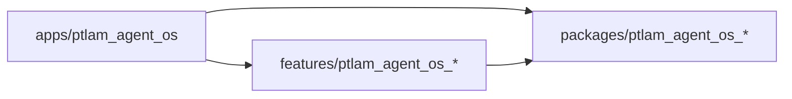

# File Organization

Where Flutter puts source and test files, how each feature expresses four
layers, and how a feature publishes its surface, then where the `src/app`
monorepo puts apps, features, and packages and what each kind publishes.

## Grow into the single-package structure

Use this layout in every project except the PTLam Agent OS monorepo;
[SKILL.md](../SKILL.md#choose-the-layout) says how to tell them apart.

Keep a small application flat until a second business capability makes feature
folders useful. Once a capability owns a feature folder, place its code under
`application/`, `domain/`, `infrastructure/`, or `presentation/`. Create a
subfolder only when its first owned file appears.

```text
<project_name>/
├── .fvmrc
├── analysis_options.yaml
├── pubspec.yaml
├── pubspec.lock
├── lib/
│   ├── main.dart                    # runs the app only
│   ├── settings.dart                # typed application configuration, when needed
│   ├── db.dart                      # database initialization, when needed
│   ├── app/                         # UI shell, routing, and global composition only
│   │   ├── app.dart                 # installs the design-system ThemeData
│   │   ├── app_router.dart
│   │   └── di.dart                  # registers concrete get_it dependencies
│   ├── integrations/                # shared clients and SDK facades
│   ├── shared/                      # framework-neutral, proven cross-feature reuse
│   ├── packages/                    # boundaries prepared for package extraction
│   │   ├── <project_name>_logger/
│   │   │   ├── <project_name>_logger.dart
│   │   │   └── src/
│   │   │       └── app_logger.dart
│   │   └── <project_name>_design_system/
│   │       ├── <project_name>_design_system.dart
│   │       └── src/
│   │           ├── style/
│   │           ├── theme/
│   │           └── components/
│   └── features/
│       └── orders/                  # one business capability
│           ├── orders.dart          # public feature export
│           ├── application/
│           │   ├── dtos/            # wire, storage, and plugin shapes
│           │   │   └── order_response_dto.dart
│           │   ├── ports/           # repository and outbound contracts
│           │   │   └── orders_repository.dart
│           │   └── use_cases/       # one application operation per file
│           │       └── place_order_use_case.dart
│           ├── domain/
│           │   ├── entities/
│           │   │   └── order.dart
│           │   ├── failures/
│           │   │   └── orders_failure.dart
│           │   └── value_objects/
│           ├── infrastructure/
│           │   ├── adapters/        # application-port implementations
│           │   │   └── cached_orders_repository.dart
│           │   ├── clients/         # remote API mechanics
│           │   │   └── orders_api_client.dart
│           │   └── data_sources/    # storage and platform-plugin mechanics
│           │       └── orders_local_data_source.dart
│           └── presentation/
│               ├── bloc/            # BLoCs, Cubits, events, and states
│               │   ├── orders_bloc.dart
│               │   ├── orders_event.dart
│               │   └── orders_state.dart
│               ├── pages/
│               │   └── orders_page.dart
│               └── widgets/
│                   └── order_card.dart
├── test/                             # mirrors lib, then adds the level
│   ├── packages/
│   │   └── <project_name>_logger/
│   │       └── unit/
│   └── features/
│       └── orders/
│           ├── test_doubles/         # doubles shared across levels
│           ├── unit/
│           │   ├── application/
│           │   │   └── use_cases/
│           │   ├── domain/
│           │   └── presentation/
│           │       └── bloc/
│           └── integration/
│               ├── infrastructure/
│               └── presentation/
└── tool/                             # deterministic project scripts, when needed
```

Keep this tree as plain text so it renders in every editor, terminal, diff, and
review. Localization is an ordinary feature with the same four layers and public
export; it adds its string classes under `localization/i18n/`.

## Give each layer one role

| Path                           | Owns                                                         |
| ------------------------------ | ------------------------------------------------------------ |
| `<feature>.dart`               | The capability's deliberate public exports                   |
| `application/dtos/`            | Wire, storage, and plugin shapes without SDK dependencies    |
| `application/ports/`           | Repository and outbound contracts consumed by use cases      |
| `application/use_cases/`       | One transport-neutral application operation per file         |
| `domain/entities/`             | Domain values with identity                                  |
| `domain/failures/`             | Stable failures application and presentation code may handle |
| `domain/value_objects/`        | Immutable domain values defined by their contents            |
| `infrastructure/adapters/`     | Implementations of application ports                         |
| `infrastructure/clients/`      | Remote API clients with no product policy                    |
| `infrastructure/data_sources/` | Storage and platform-plugin access                           |
| `presentation/bloc/`           | BLoCs, Cubits, events, and states                            |
| `presentation/pages/`          | Route-level pages that provide or observe state holders      |
| `presentation/widgets/`        | Feature widgets and UI effects                               |

BLoC is part of the presentation layer. Widgets provide and observe it, but the
state holder delegates product operations to use cases and has no `BuildContext`
or widget dependency.

## Publish one feature surface

`<feature_name>/<feature_name>.dart` exports everything another feature may use:
usually the page, its route, an application facade, and the domain types that
cross the boundary. It never exports infrastructure. Another feature imports
that file instead of reaching into layer folders.
[state-management.md](state-management.md) owns the file layout inside
`presentation/bloc/`. The same rule governs `packages/`: the barrel file is the
surface, and `src/` is private.

## Place code by responsibility

| Adding                                       | Put it in                                               |
| -------------------------------------------- | ------------------------------------------------------- |
| A BLoC or Cubit                              | `features/<name>/presentation/bloc/`                    |
| A wire, storage, or plugin DTO               | `features/<name>/application/dtos/`                     |
| A repository or outbound contract            | `features/<name>/application/ports/`                    |
| A use case                                   | `features/<name>/application/use_cases/`                |
| A domain entity                              | `features/<name>/domain/entities/`                      |
| A domain failure                             | `features/<name>/domain/failures/`                      |
| A value object                               | `features/<name>/domain/value_objects/`                 |
| A repository or platform-port implementation | `features/<name>/infrastructure/adapters/`              |
| A remote API client                          | `features/<name>/infrastructure/clients/`               |
| A storage or platform data source            | `features/<name>/infrastructure/data_sources/`          |
| The feature's route-level page               | `features/<name>/presentation/pages/`                   |
| A private widget used only by one owner      | The owning widget's file                                |
| A public component widget                    | `features/<name>/presentation/widgets/`                 |
| A widget two features render                 | `packages/<project_name>_design_system/src/components/` |
| Something two features really share          | `lib/shared/`                                           |
| A shared client or SDK facade                | `lib/integrations/`                                     |

`shared/` is for framework-neutral code already used by two features, not for
what might be shared later. Keep shared external-system setup in
`integrations/`; keep feature mapping and policy in the owning feature.

Keep a helper or constant in its only consumer's file. When another file in the
same layer needs it, give it a narrowly named file there; add a folder only for
a real grouping. Never add feature-root `utils/`, `helpers/`, `models/`, or
`constants/` buckets.

## Suffix a class with its role

Suffix every state holder, repository, use case, client, and data source with
its role: `OrdersBloc`, `OrdersRepository`, `PlaceOrderUseCase`,
`OrdersApiClient`, `AppLocaleLocalDataSource`. Do not suffix a domain type or
DTO with a vague `Model`: `Order` for the entity, `OrderResponseDto` for the
external shape.

## Monorepo: three package kinds

These rules apply only in the monorepo. The four layers above still govern the
inside of each feature.

```text
src/app/
├── .fvmrc
├── pubspec.yaml                          # pub workspace members and Melos scripts
├── apps/
│   └── ptlam_agent_os/                   # the runnable app for web and macOS
│       ├── pubspec.yaml                  # depends on features and packages
│       ├── analysis_options.yaml         # includes analysis_options.flutter.yml
│       ├── lib/
│       │   ├── main.dart                 # runs the app only
│       │   └── app/
│       │       ├── app.dart              # MaterialApp, theme, localization delegates
│       │       ├── app_router.dart       # one GoRouter composed from feature routes
│       │       ├── di.dart               # registers packages, then each feature
│       │       └── settings.dart         # typed application configuration, when needed
│       ├── test/                         # tests for app-owned code
│       ├── integration_test/             # end-to-end journeys
│       └── test_driver/
├── features/
│   └── ptlam_agent_os_<feature>/
│       ├── pubspec.yaml                  # depends on packages only
│       ├── analysis_options.yaml         # includes analysis_options.flutter.yml
│       ├── lib/
│       │   ├── ptlam_agent_os_<feature>.dart   # public surface
│       │   └── src/
│       │       ├── <feature>_di.dart     # register<Feature>Feature(GetIt)
│       │       ├── application/          # dtos, ports, use_cases
│       │       ├── domain/               # entities, value_objects, failures
│       │       ├── infrastructure/       # adapters, data_sources
│       │       ├── presentation/         # bloc, pages, widgets, routes
│       │       └── i18n/                 # strings classes, one per locale
│       └── test/
│           ├── test_doubles/             # doubles shared across levels
│           ├── integration/              # mirrors lib/src
│           ├── golden/
│           └── unit/                     # mirrors lib/src
└── packages/
    └── ptlam_agent_os_<package>/
        ├── pubspec.yaml                  # depends on packages only
        ├── analysis_options.yaml         # .dart.yml, or .flutter.yml when it imports Flutter
        ├── lib/
        │   ├── ptlam_agent_os_<package>.dart   # public surface
        │   └── src/                      # flat; no layers
        └── test/
```

| Kind    | Purpose                                                  | Structure                                     |
| ------- | -------------------------------------------------------- | --------------------------------------------- |
| App     | Composes features and packages into one runnable product | `lib/main.dart` and `lib/app/`; no layers     |
| Feature | One product capability the operator can name             | The four layers under `lib/src/`              |
| Package | One reusable boundary with no product logic              | `lib/src/` organized by what the package does |

The single-package tree above (`lib/features/`, `lib/packages/`,
`lib/integrations/`, `lib/shared/`) does not apply here. Each of those folders
is a package of its own in this monorepo.

## Dependencies point one way



A feature never lists another feature in its `pubspec.yaml`. Pub does not reject
that edge, so check the dependency list when you add one. When two features need
the same code, move it to a package. When one feature needs another's behavior,
[composition.md](composition.md#joining-features-in-the-app) owns the port the
app fulfills.

## Adding a feature or package

1. Name it `ptlam_agent_os_<name>` and make the folder name match.
2. Set `resolution: workspace` and `publish_to: none` in its `pubspec.yaml`, and
   include the matching `ptlam_agent_os_lints` options file.
3. Confirm the root `pubspec.yaml` `workspace:` list covers its folder, then run
   `melos bootstrap` from `src/app`.
4. Add it to each dependent's `pubspec.yaml` with `fvm dart pub add`.

## One file spells the published surface

`lib/ptlam_agent_os_<name>.dart` exports what the app may use and nothing else.
For a feature that is its pages, its route declarations and route list, its
register function, and the domain types that cross to the app. Infrastructure
never leaves the feature. Everything under `lib/src/` is private.

## Where a monorepo-level file goes

| Adding                                                      | Put it in                                                               |
| ----------------------------------------------------------- | ----------------------------------------------------------------------- |
| A widget two features render                                | `packages/ptlam_agent_os_design_system/lib/src/components/`             |
| `AppLogger`                                                 | `packages/ptlam_agent_os_logger/`                                       |
| The client for the PTLam Agent OS API                       | `packages/ptlam_agent_os_api_client/`, written against the API contract |
| A client or plugin wrapper for another external system      | `packages/ptlam_agent_os_<system>/`                                     |
| Code two features share                                     | A package named for what it does                                        |
| The router, dependency wiring, theme, or an app-only screen | `apps/ptlam_agent_os/lib/app/`                                          |

A package earns its place when its second consumer appears. Until then the code
belongs to the feature that has it. A feature's `infrastructure/clients/` exists
only for an API no package wraps; a data source in
`infrastructure/data_sources/` adapts a client package to the feature's ports.

Name a port implementation after its source: `OrdersRepository` is the port in
`application/ports/`, `ApiOrdersRepository` its adapter in
`infrastructure/adapters/`.

Finish when every feature source file apart from its public export sits in one
explicit layer, BLoCs and Cubits sit under `presentation/`, public imports enter
the feature export, infrastructure stays private, tests mirror capability and
layer ownership, and in the monorepo every import follows the
app-to-feature-to-package direction and each package publishes one surface file.
