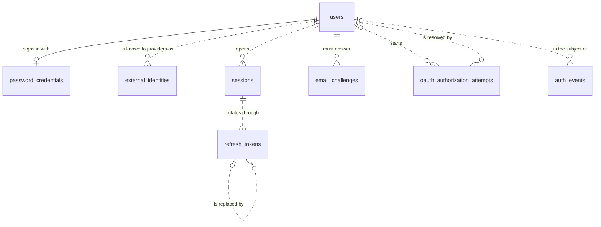
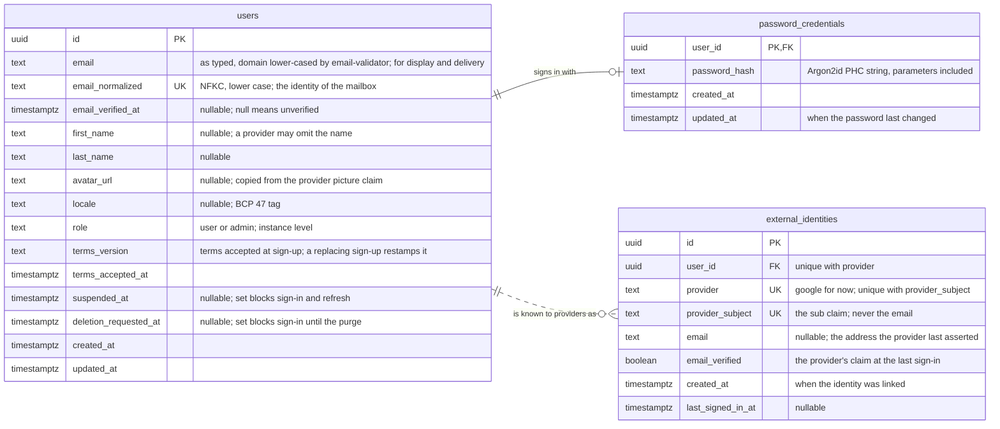
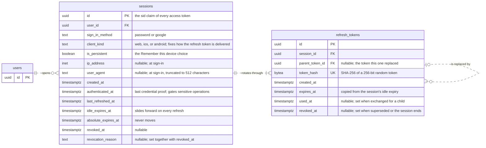
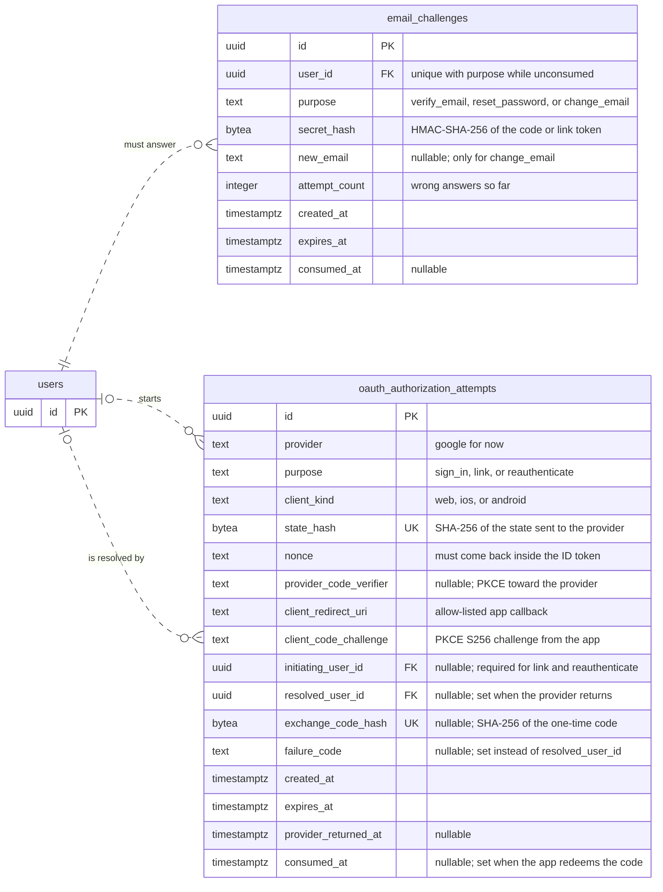
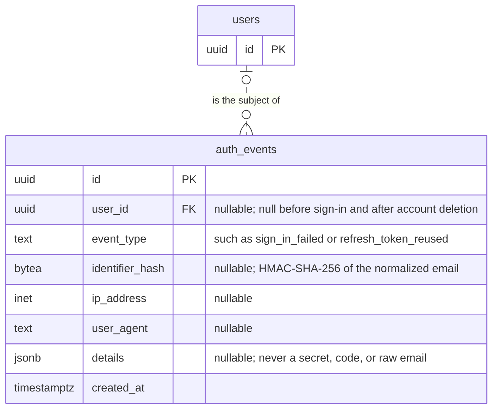

# Authentication ERD (physical)

Scope: the 8 tables the `auth` backend feature owns in the `public` schema of
PostgreSQL 18. This file owns tables, columns, keys, and retention.
[auth-specification.md](18_09_2026__auth-specification.md) owns behavior and never repeats
column lists. Revision `0001` in `apps/backend/migrations/versions/` creates
all eight tables, and `features/auth/infrastructure/db/tables/` maps them, one
`<name>_table.py` per table.

Conventions for every table:

- Table names are plural `snake_case`. Entity ids in the diagrams are singular;
  the quoted label is the real table name.
- Every surrogate key is `uuid` with `DEFAULT uuidv7()`, so keys sort by
  creation time and index well.
- Every instant is `timestamptz`. A nullable instant states a fact that has not
  happened yet, such as `consumed_at`; there are no sentinel values.
- Only surrogate keys have a database default. The application sets every
  other value, and its `Clock` sets every instant, so tests control time.
- A closed vocabulary is `text` with a `CHECK` constraint, not a PostgreSQL
  `ENUM`, so adding a value is a one-line migration.
- A solid line (`--`) marks an identifying relationship: the child's primary key
  is the parent's key. A dotted line (`..`) marks a plain foreign key.
- No secret is stored in the clear. Tokens, codes, and OAuth `state` values are
  stored as hashes. No provider token is stored.
- Constraint and index names are deterministic, so a later revision can alter
  or drop them by name: `pk_<table>`, `fk_<table>_<column>_<referenced table>`,
  `uq_<table>_<columns>`, `ck_<table>_<rule>`, and `ix_<table>_<columns>`. A
  partial index names its condition, such as
  `uq_email_challenges_unconsumed_user_id_purpose`.

## Which tables exist and how do they connect?

Every foreign key to `users` is `ON DELETE CASCADE`, except
`auth_events.user_id`, which is `ON DELETE SET NULL` so the audit trail
outlives the account without naming it. Inside a session's token family,
`refresh_tokens.session_id` is `ON DELETE CASCADE`, so a purged session takes
its tokens with it, and `refresh_tokens.parent_token_id` is
`ON DELETE SET NULL`, so the purge can delete an expired parent before its
child.

## What identifies a user and proves who they are?

- A social-only user has no `password_credentials` row. A password-only user
  has no `external_identities` row. A user always has at least one of the two;
  the unlink and remove-password use cases enforce it.
- `external_identities` has two unique constraints: `(provider,
  provider_subject)` finds the returning user, and `(user_id, provider)` keeps
  one identity per provider per user.
- Provider tokens are discarded after the ID token is verified, because the
  service never calls provider APIs. Adding a provider is a new `provider`
  value in the `CHECK` constraint.

## How is a signed-in device tracked and revoked?

- A session is one sign-in on one device. Its refresh tokens form one family:
  presenting a token that is already used or revoked revokes the whole session.
- `revocation_reason` is one of `signed_out`, `revoked_by_user`,
  `password_changed`, `refresh_token_reused`, `account_suspended`,
  or `account_deleted`. A `CHECK` keeps it null
  exactly when `revoked_at` is null.
- Index `sessions (user_id)` serves the session list, the revoke-all
  operations, and the cascade from `users`.
- Indexes `refresh_tokens (session_id)` and `refresh_tokens (parent_token_id)`
  serve revoking a session's tokens, finding a token's child, and the two
  delete rules, which PostgreSQL runs once per deleted row.

## Which short-lived proofs does a flow leave behind?

- `email_challenges` has a partial unique index on `(user_id, purpose) WHERE
  consumed_at IS NULL`. Requesting a new challenge deletes the open one, so at
  most one code or link is valid per purpose.
- A `verify_email` or `change_email` challenge is a 6-digit code looked up by
  `(user_id, purpose)`. A `reset_password` challenge is a 256-bit link token
  looked up by `secret_hash`, which has its own index.
- One `oauth_authorization_attempts` row follows a browser sign-in through three
  instants: `created_at`, `provider_returned_at`, and `consumed_at`. Each step
  requires the previous instant to be set and its own to be null, which makes
  every `state` and every exchange code single-use.
- `nonce` and `provider_code_verifier` are stored in the clear on purpose. They
  are useless without the matching browser redirect and expire after 10
  minutes.
- `failure_code` is plain `text` without a `CHECK`: it holds the API's failure
  codes, which grow with the flows.

## What is recorded for audit and throttling?

- The sign-in throttle counts recent `sign_in_failed` rows, so the audit trail
  and the throttle share one source of truth.
- `identifier_hash` lets the throttle group attempts against an email that has
  no account, without storing what an attacker or a confused user typed.
- Indexes: `(identifier_hash, event_type, created_at)`, `(ip_address,
  event_type, created_at)`, and `(user_id, created_at)`.
- `event_type` is plain `text` without a `CHECK`: its values grow with the
  flows that record events. Sign-up records `existing_account_notice_sent`,
  which also paces the next notice to that user.

## Retention

The purge task in the specification deletes rows on this schedule.

| Table                          | Deleted when                                        |
|--------------------------------|-----------------------------------------------------|
| `email_challenges`             | 1 day after `expires_at`                            |
| `oauth_authorization_attempts` | 1 day after `expires_at`                            |
| `refresh_tokens`               | 1 day after `expires_at`                            |
| `sessions`                     | 30 days after `revoked_at` or `absolute_expires_at` |
| `auth_events`                  | 90 days after `created_at`                          |
| `users`                        | once `deletion_requested_at` is set                 |
