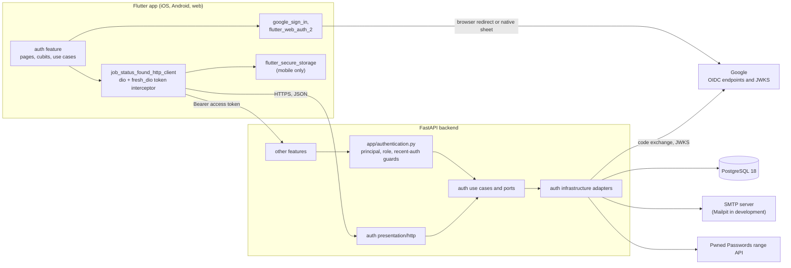
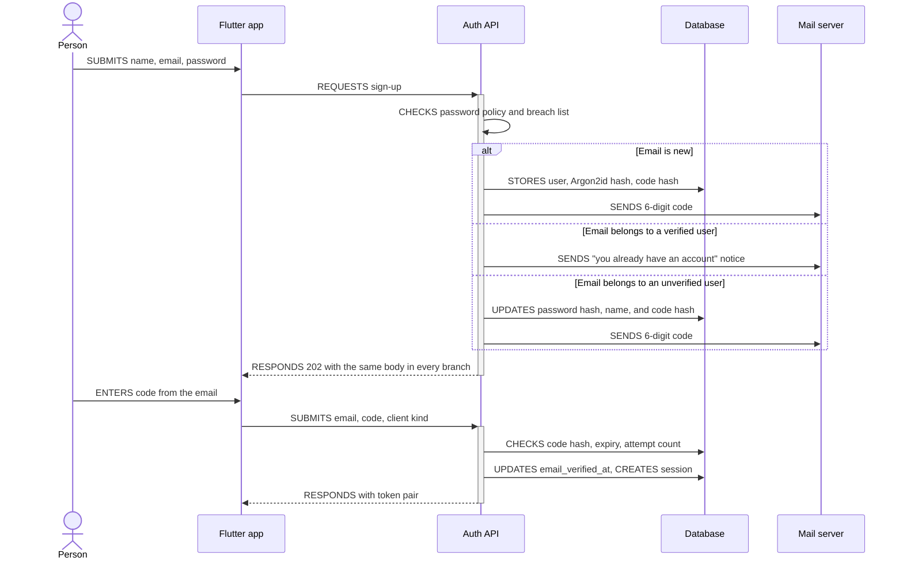
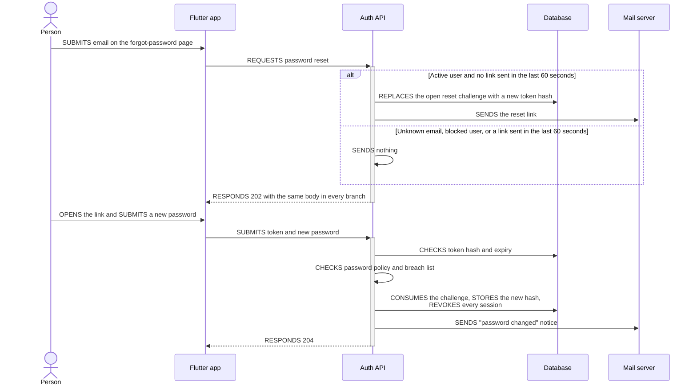
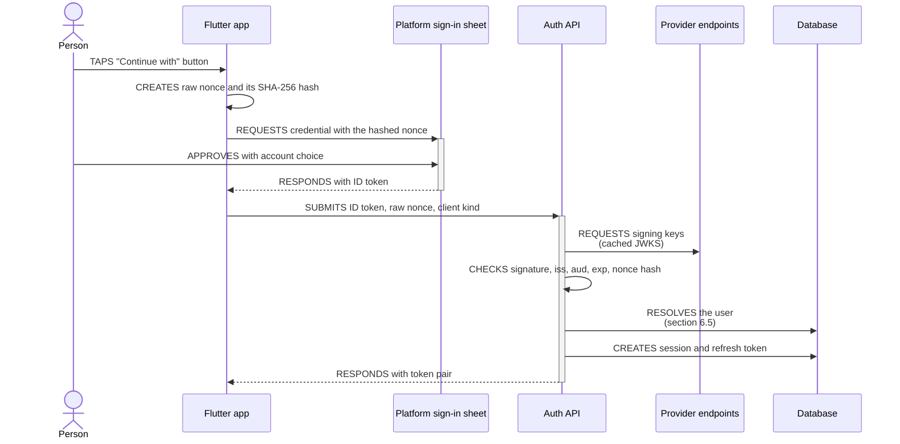
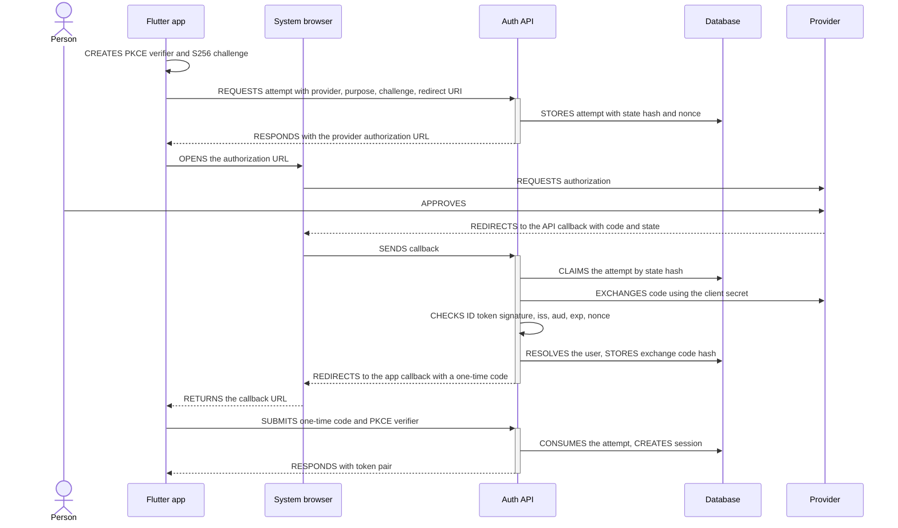
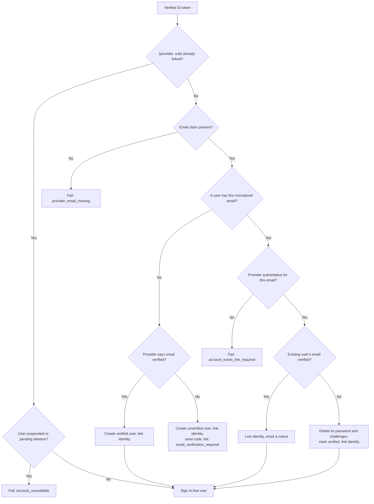
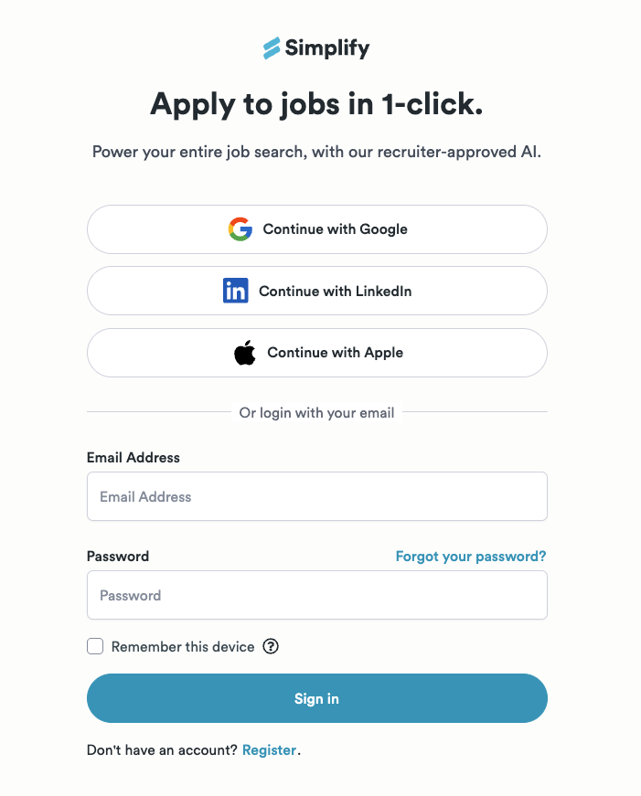
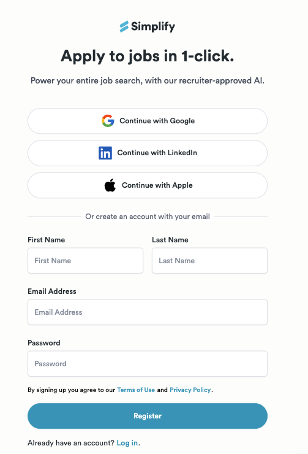

# Authentication and authorization specification

Status: proposed. Only the schema and its first migration are implemented
(ticket T-01). Package versions and provider facts were verified on
2026-09-18; section 15 lists what is still unverified.

Sign-up and sign-in with email and password and Google, for
the Flutter app (iOS, Android, web) and the FastAPI backend. The sign-in and
sign-up pages follow the mock-ups [login_page.png](assets/login_page_ui.png) and
[register_page.png](assets/register_page_ui.png), with the wordmark "JSV" and no logo
icon; section 11.2 specifies them.

Tables, columns, keys, and retention live in [auth-erd.md](18_09_2026__auth-erd.md).

## 1. Decisions

| Id  | Decision                                                                                                                                     | Main reason                                                                                               |
|-----|----------------------------------------------------------------------------------------------------------------------------------------------|-----------------------------------------------------------------------------------------------------------|
| D-1 | Build auth inside the FastAPI backend as the `auth` feature, from vetted packages. Run no separate identity service.                         | One deployable, data in our PostgreSQL, fits the four-layer features, full control over identity linking  |
| D-2 | A 15-minute JWT access token plus a rotating opaque refresh token with reuse detection, both bound to a `sessions` row.                      | RFC 9700 requires rotation or sender-constraining for public clients; a session row makes revocation real |
| D-3 | The refresh token reaches the web app only as an `HttpOnly` cookie and a mobile app only in the response body, kept in Keychain or Keystore. | A script on the web page can never read a long-lived credential                                           |
| D-4 | Use the platform's own sign-in sheet where one exists (Google on Android). Everywhere else use one browser flow that the backend mediates.   | Best experience where the platform offers it, and one code path for the rest                              |
| D-5 | Find a returning social user by `(provider, sub)` only. Link to an existing account by email only when both sides have verified that email.  | Blocks the pre-hijacking account takeover class                                                           |
| D-6 | An email sign-up gets no session until a 6-digit code proves control of the mailbox.                                                         | Same takeover class; a code works across devices without deep links                                       |
| D-7 | Store no provider token.                                                                                                                     | We never call provider APIs                                                                               |
| D-8 | Authorize by resource ownership plus one instance-level role. Add no RBAC tables or policy engine yet.                                       | Every resource belongs to exactly one user today                                                          |

### Why build in-process instead of adopting an identity service?

| Option                                | Verdict   | Deciding facts                                                                                                                                   |
|---------------------------------------|-----------|--------------------------------------------------------------------------------------------------------------------------------------------------|
| In-process feature from packages      | Chosen    | Protocol and cryptography come from packages (section 4); we own only orchestration and tables                                                   |
| Supabase Auth (GoTrue), self-hosted   | Runner-up | Covers both methods and has a Flutter SDK.  Costs a second service the app calls directly, and auth tables in a schema our migrations do not own |
| Firebase Authentication               | Rejected  | Users live outside PostgreSQL, vendor lock-in                                                                                                    |
| Keycloak, Zitadel, Ory                | Rejected  | Built around hosted login pages or heavy services; the mock-ups need native in-app forms                                                         |
| `fastapi-users`                       | Rejected  | README: "now in maintenance mode"; no refresh tokens; no ID-token sign-in (both verified in its source)                                          |
| better-auth sidecar (what Kaneo runs) | Rejected  | Adds a Node.js runtime to a Python and Dart stack                                                                                                |

Change this decision when the product needs enterprise SSO (SAML), or several
backends must share sign-in. The access token is a standard JWT with `iss`,
`aud`, and `sub`, so resource endpoints keep working when an identity service
starts issuing it.

The Supabase and Firebase rows rest on prior knowledge, not on a check made for
this document.

## 2. Scope

In scope: sign-up, email verification, sign-in, sign-out, token refresh,
password reset and change, email change, Google sign-in, linking
and unlinking, re-authentication for sensitive operations, session list and
revocation, account deletion, audit events, throttling, and the authorization
rules every other feature follows.

Out of scope for now, with the extension point:

| Not included                          | How it fits later                                                                                   |
|---------------------------------------|-----------------------------------------------------------------------------------------------------|
| TOTP, passkeys                        | New factor tables beside `password_credentials`; `sessions.authenticated_at` already models step-up |
| Teams, workspaces, RBAC               | Membership tables plus policy checks in use cases; the JWT keeps carrying only the instance role    |
| Magic links, phone sign-in            | New `email_challenges.purpose` value or a sibling table                                             |
| Admin console, impersonation          | New use cases guarded by the `admin` role                                                           |
| Opening email links in the mobile app | `app_links` 7.2.1 with Universal Links and App Links                                                |
| Apple and LinkedIn sign-in            | A new `provider` value, its verifier configuration, and its console setup; the flows stay the same  |

## 3. Architecture

### Which component talks to which?



### Which sign-in mechanism runs on which platform?

| Method         | iOS          | Android                                      | Web          |
|----------------|--------------|----------------------------------------------|--------------|
| Email+password | In-app form  | In-app form                                  | In-app form  |
| Google         | Browser flow | Native Credential Manager (`google_sign_in`) | Browser flow |

- "Native sheet" means the plugin returns an ID token and the backend verifies
  it (section 6.3).
- "Browser flow" means `flutter_web_auth_2` opens the provider in the system
  browser and the backend completes the authorization-code exchange (section
  6.4). It is RFC 8252's recommended shape for native apps.
- Google on the web uses the browser flow because `google_sign_in` on the web
  cannot sign in from a custom button: `authenticate()` throws and only
  Google's own `renderButton()` works, and the button must match the design system.
- Google on iOS uses the browser flow because the Google iOS SDK opens the same
  system browser session and would only add a pod and URL-scheme setup.

Delivery can start with the browser flow everywhere and add the Android native
sheet afterwards; the backend contract does not change (section 13).

## 4. Packages

Versions are the latest on 2026-09-18. All support Python 3.14 or the project's
Dart `^3.13.2` unless noted.

### Backend

| Need                    | Package                                             | Version               | Note                                                                                                                                                                                        |
|-------------------------|-----------------------------------------------------|-----------------------|---------------------------------------------------------------------------------------------------------------------------------------------------------------------------------------------|
| Password hashing        | `pwdlib[argon2]`                                    | 0.3.1                 | What the FastAPI tutorial now recommends. `PasswordHash.recommended()` gives Argon2id with m=65536, t=3, p=4, above the OWASP minimum of m=19456, t=2, p=1                                  |
| JWT issue and verify    | `pyjwt[crypto]`                                     | 2.14.0                | Our access tokens (HS256), provider ID tokens (RS256 through `PyJWKSet`)                                                                                                                    |
| OAuth 2.0 code flow     | `authlib`                                           | 1.8.0                 | Only `AsyncOAuth2Client`: authorization URL, PKCE S256, token request. Not its Starlette integration, which needs `SessionMiddleware` cookies; state lives in a table instead (section 6.4) |
| Outbound HTTP           | `httpx2`                                            | 2.13.0                | Already the project's test client; Authlib 1.8 builds on it. Moves from `dev` to runtime                                                                                                    |
| ORM, driver, migrations | `sqlalchemy[asyncio]`, `psycopg[binary]`, `alembic` | 2.0.54, 3.3.6, 1.20.0 | psycopg 3 serves the async app and the sync Alembic run with one driver                                                                                                                     |
| Email delivery          | `aiosmtplib`                                        | 5.1.3                 | Behind a port, so a provider API can replace SMTP                                                                                                                                           |
| Per-IP throttle         | `limits`                                            | 5.8.0                 | Async in-memory storage; correct for one worker. Swap its storage for Redis when a second worker appears                                                                                    |
| Email syntax            | `pydantic[email]`                                   | -                     | Enables `EmailStr`; version not checked                                                                                                                                                     |

Not used: `fastapi-users` (section 1), `passlib` (last release 2020),
`slowapi` (pre-1.0 wrapper over `limits`; we call `limits` directly),
`PyJWKClient` from PyJWT (blocking `urllib`; JWKS documents are fetched with
`httpx2` and cached instead).

### Frontend

| Need                         | Package                  | Version | Note                                                                                                                                             |
|------------------------------|--------------------------|---------|--------------------------------------------------------------------------------------------------------------------------------------------------|
| Google native sheet, Android | `google_sign_in`         | 7.2.0   | Uses Credential Manager. `initialize(serverClientId: <web client id>, nonce: ...)`, then `authenticate()`, then `account.authentication.idToken` |
| Browser flow                 | `flutter_web_auth_2`     | 5.1.0   | `authenticate(url, callbackUrlScheme, options)`. On the web it needs `web/auth.html` on the app's origin                                         |
| Token attach, refresh, retry | `fresh_dio`              | 0.6.0   | By the author of `bloc`. Single-flights concurrent refreshes, refreshes 30 s before expiry, exposes `authenticationStatus`                       |
| Token storage, mobile        | `flutter_secure_storage` | 11.2.0  | Already a project dependency. Not used on the web, where its README calls the implementation experimental                                        |
| PKCE and nonce hashing       | `crypto`                 | -       | SHA-256; version not checked                                                                                                                     |
| Terms and privacy links      | `url_launcher`           | -       | Already a transitive dependency of `flutter_web_auth_2`; version not checked                                                                     |
| Path URLs on the web         | `flutter_web_plugins`    | SDK     | `usePathUrlStrategy()` so the reset link is `/reset-password?token=...`, not a `#` fragment                                                      |

None needs code generation. `google_sign_in_android` 7.2.17 requires Flutter
3.44 or newer; confirm `.fvmrc`
before adding them.

## 5. Tokens and sessions

### Access token

- JWT signed with HS256. The backend is the only issuer and the only verifier,
  so a shared secret is enough. Move to ES256 with a JWKS endpoint when a
  second service must verify tokens.
- Header: `alg=HS256`, `typ=at+jwt` (RFC 9068), `kid`. Settings hold a key ring
  of `kid` to secret: one signing key, any number of verify-only keys, so a key
  rotates without signing anyone out.
- Claims: `iss` (the API's public URL), `aud` (`job-status-found-api`), `sub`
  (user id), `sid` (session id), `role`, `iat`, `exp`, `jti`.
- Verification follows RFC 8725: the algorithm is pinned to `HS256`, and
  `iss`, `aud`, `exp`, and `typ` are all required. It reads no table.
- Lifetime 15 minutes. That is also the longest a revoked session, a suspended
  user, or a changed role keeps working on ordinary endpoints. The guards for
  sensitive operations load the session row, so those react immediately.

### Refresh token

- 256 random bits from `secrets.token_urlsafe(32)`. Only its SHA-256 is stored;
  a fast hash is right for a high-entropy secret.
- Every use rotates it. `POST /v1/auth/token/refresh` runs in one transaction,
  with the session row locked:

1. Hash the presented token and find its row. Not found: fail with
   `refresh_token_invalid`.
2. Fail with `session_ended` when the session is revoked or past either expiry,
   or the user is suspended or pending deletion.
3. Token unused and not revoked: set `used_at`, insert a child token, move
   `idle_expires_at` to `min(now + idle lifetime, absolute_expires_at)`, and
   return a new access token and the child.
4. Token used less than 10 seconds ago and its child is still unused: the
   response was lost in transit. Revoke that child, insert a new one, and return
   it.
5. Any other used or revoked token is a replay. Revoke the session with reason
   `refresh_token_reused`, record an `auth_events` row, and fail with
   `session_ended`. Both the thief and the owner must sign in again, which is
   the intended outcome of RFC 9700's reuse rule.

### Delivery by client kind

`client_kind` (`web`, `ios`, `android`) is sent at sign-in and stored on the
session. It fixes the delivery channel for the session's whole life, so a script
on the web page cannot ask for a body-delivered token for an existing web
session.

| Client kind      | Access token                                        | Refresh token                                                                                                     |
|------------------|-----------------------------------------------------|-------------------------------------------------------------------------------------------------------------------|
| `ios`, `android` | Response body; kept in memory and in secure storage | Response body; `flutter_secure_storage`                                                                           |
| `web`            | Response body; kept in memory only                  | `Set-Cookie: __Secure-jsf_refresh=...; HttpOnly; Secure; SameSite=Strict; Path=/v1/auth` and absent from the body |

- The web app restores its session after a reload by calling the refresh
  endpoint; the browser attaches the cookie.
- Cookie endpoints (`token/refresh`, `sign-out`) also require an `Origin` header
  that matches the CORS allow-list. With `SameSite=Strict` that closes CSRF.
- The app and the API must be same-site for the cookie to flow:
  `app.example.com` with `api.example.com`, or two `localhost` ports. A public
  suffix host such as `*.vercel.app` is cross-site and will not work.
- `JSF_AUTH_COOKIE_SECURE=false` and a cookie name without the `__Secure-`
  prefix are for local `http://localhost` only, because shipped Safari versions
  may still reject `Secure` cookies there.

### Lifetimes

Every value is a setting; these are the defaults.

| Item                                | Default                                                                                             |
|-------------------------------------|-----------------------------------------------------------------------------------------------------|
| Access token                        | 15 minutes                                                                                          |
| Session, "Remember this device" on  | 30 days idle, 180 days absolute                                                                     |
| Session, "Remember this device" off | 24 hours idle, 7 days absolute; on the web the cookie has no `Max-Age`, so it ends with the browser |
| Recent-authentication window        | 10 minutes                                                                                          |
| Email verification code             | 15 minutes, 5 attempts, 60 seconds between sends                                                    |
| Password reset link                 | 30 minutes, single use, 60 seconds between sends                                                    |
| OAuth authorization attempt         | 10 minutes                                                                                          |
| OAuth exchange code                 | 60 seconds, single use                                                                              |
| Refresh reuse grace                 | 10 seconds                                                                                          |

Every request that creates a session carries `remember_me`, and the backend
stores it as `sessions.is_persistent`. The web app sends the state of the
"Remember this device" checkbox, which starts unchecked; the sign-up page has
no checkbox, so a web sign-up is not persistent. The iOS and Android apps hide
the checkbox and always send `true`, because a phone is a personal device and
an app that forgets its user every day is not what people expect.

### Recent authentication

Setting a first password, changing the email, linking or unlinking a provider,
and deleting the account require `sessions.authenticated_at` to be at most 10
minutes old. Otherwise the endpoint fails with `recent_authentication_required`
and the app asks for the password, or runs a provider flow with purpose
`reauthenticate`. Changing an existing password needs no window because the
current password is part of the request.

## 6. Flows

### 6.1 How does an email sign-up become a session?



- The 202 body and timing are the same in every branch, so the endpoint does not
  reveal which emails have accounts.
- The third branch overwrites the unverified user's password and name. Nobody
  has proven that mailbox yet, so the latest sign-up wins, and whoever holds the
  mailbox decides by entering the code.
- A wrong code increments `attempt_count`; the fifth wrong code consumes the
  challenge.

### 6.2 Password sign-in, reset, and change

- **Sign-in.** Unknown email and wrong password both take the same time (a dummy
  Argon2id verification runs for an unknown email or a social-only user) and
  both fail with `invalid_credentials`. A correct password on an unverified user
  sends a fresh code and fails with `email_verification_required`; the app opens
  the code page. After verifying, `pwdlib`'s `verify_and_update` rehashes a
  password stored with older parameters.
- **Reset.** A forgotten password is replaced through an emailed link; the
  next subsection specifies it.
- **Change.** Requires the current password, revokes every other session, and
  emails the notice.
- **Hashing cost.** Argon2id at 64 MiB runs in a worker thread (`anyio.to_thread`) behind a semaphore of 4, so the event
  loop stays free and
  the 512 MiB container cannot be exhausted by parallel sign-ins.

#### How does a forgotten password get reset?



- The request endpoint never reveals whether an account exists. Its body is the
  same in every branch, and the email goes out after the response, so timing
  does not reveal the branch either.
- "Blocked" means suspended or pending deletion.
- The link is `https://<web app>/reset-password?token=<256-bit token>`. It
  always opens the web app, also for someone who uses the mobile app, because
  opening email links in the app is out of scope (section 2). After the reset,
  that person returns to the app and signs in.
- The email says the link expires in 30 minutes. It also says that if the
  person did not ask for it, they can ignore it and their password stays the
  same.
- A new request replaces the open challenge, so only the latest link works.
- A social-only user gets the same link; using it adds a password.
- The token is checked before the password policy. A too-weak or breached
  password fails without consuming the token, so the person can try another
  password with the same link.
- An unknown, expired, used, or replaced token fails with the single code
  `reset_token_invalid`.
- Confirming sets `email_verified_at` if it was null, because the link proved
  the mailbox.
- Confirming does not sign in. It revokes every session, including the one on
  the device that made the reset, so a stolen session cannot outlive the
  password it was opened with.

### 6.3 How does a native sheet sign-in work?

Google on Android.



- The app sends the hash to the provider and the raw nonce to the backend. The
  backend accepts the ID token only when `SHA-256(raw nonce)` equals its `nonce`
  claim, so a stolen ID token alone cannot be replayed against our API.
- `google_sign_in` takes the nonce in `initialize()`, which runs once, so the
  Google nonce is per app start, not per attempt.
- The accepted `aud` is the Google web client id.

### 6.4 How does the browser flow work?

Google on the web and on iOS.



- The app asks for an attempt with a `POST` instead of navigating to a `GET
  /start` URL. The body can carry the PKCE challenge, and a `link` or
  `reauthenticate` attempt can be authenticated with the bearer token, which a
  browser navigation cannot send.
- Tokens never travel in a redirect URL. The redirect carries a 60-second
  one-time code that is useless without the PKCE verifier only the app holds.
  That defeats a malicious Android app that registers the same custom scheme (RFC 8252, RFC 7636).
- State lives in `oauth_authorization_attempts`, not in a cookie, so a later
  provider whose callback is a cross-site `POST` needs no redesign.
- `client_redirect_uri` must match the allow-list setting exactly: the custom
  scheme `com.ptlam.jobstatusfound:/oauth-callback` for mobile and
  `https://<web app>/auth.html` for the web.
- A failure at the callback still redirects to the app, with `error=<code>`
  instead of `code`, so the app can show a message rather than hang.

Google specifics: the callback is a `GET`; the request carries PKCE S256 and a
nonce; accept `iss` `https://accounts.google.com` and `accounts.google.com`.

### 6.5 Which user does a verified provider identity resolve to?

For purpose `sign_in`. "Authoritative" means the provider vouches for the
mailbox today: Google does when the address ends in `@gmail.com` or the `hd`
claim is set with `email_verified` true (Google's own rule).



- The email is never used to find a returning user. Google documents that an
  email can change and is not unique; `sub` is stable.
- The take-over branch is the pre-hijacking defence. An unverified account was
  created by someone who never proved the mailbox, so its password is
  discarded when the real owner arrives through an authoritative provider.
- `account_exists_link_required` tells the person to sign in the way they did
  before and link the provider under account settings.
- Purpose `link` requires that the identity belongs to no other user (`identity_already_linked`) and ignores email
  matching. Purpose
  `reauthenticate` requires that the identity belongs to the initiating user.

### 6.6 Account deletion

1. `DELETE /v1/auth/me` (recent authentication required) sets
   `deletion_requested_at`, revokes every session, and returns 202. Sign-in and
   refresh fail from that moment.
2. The purge task (section 10) deletes the `users` row; the cascade removes
   the rest.

App Store guideline 5.1.1 (v) requires in-app account deletion. Guideline 4.8
requires an equivalent privacy-preserving login when an iOS app offers
third-party login such as Google; section 15 tracks that risk.

## 7. API contract

Base path `/v1/auth`. JSON bodies use `snake_case`. "Bearer" means a valid
access token; "Recent" adds the recent-authentication rule. `TokenPair` is
`access_token`, `expires_in`, `token_type`, and `refresh_token` (absent for
`web`).

| Method and path                        | Auth                    | Success                                    | Promised failures                                                           |
|----------------------------------------|-------------------------|--------------------------------------------|-----------------------------------------------------------------------------|
| `POST /sign-up`                        | -                       | 202                                        | `password_too_weak`, `password_breached`                                    |
| `POST /email-verification/confirm`     | -                       | 200 `TokenPair`                            | `verification_code_invalid`                                                 |
| `POST /email-verification/resend`      | -                       | 202                                        | -                                                                           |
| `POST /sign-in`                        | -                       | 200 `TokenPair`                            | `invalid_credentials`, `email_verification_required`, `account_unavailable` |
| `POST /sign-in/{provider}/id-token`    | -                       | 200 `TokenPair`                            | `provider_token_invalid`, plus the section 6.5 failures                     |
| `POST /oauth/{provider}/attempts`      | - or Bearer             | 201 `authorization_url`                    | `redirect_uri_not_allowed`, `provider_not_configured`                       |
| `GET, POST /oauth/{provider}/callback` | state                   | 303 to the app                             | Redirects with `error=<code>`                                               |
| `POST /oauth/exchange`                 | - or Bearer             | 200 `TokenPair`                            | `exchange_code_invalid`                                                     |
| `POST /token/refresh`                  | refresh token           | 200 `TokenPair`                            | `refresh_token_invalid`, `session_ended`                                    |
| `POST /sign-out`                       | refresh token or Bearer | 204                                        | -                                                                           |
| `POST /password-reset/request`         | -                       | 202                                        | -                                                                           |
| `POST /password-reset/confirm`         | -                       | 204                                        | `reset_token_invalid`, `password_too_weak`, `password_breached`             |
| `PUT /password`                        | Bearer                  | 204                                        | `invalid_credentials`, `recent_authentication_required` (first password)    |
| `POST /reauthentication`               | Bearer                  | 204                                        | `invalid_credentials`                                                       |
| `GET /me`                              | Bearer                  | 200 user, `has_password`, linked providers | -                                                                           |
| `DELETE /me`                           | Recent                  | 202                                        | `recent_authentication_required`                                            |
| `POST /email-change/request`           | Recent                  | 202                                        | `recent_authentication_required`                                            |
| `POST /email-change/confirm`           | Bearer                  | 204                                        | `verification_code_invalid`                                                 |
| `DELETE /identities/{provider}`        | Recent                  | 204                                        | `last_sign_in_method`                                                       |
| `GET /sessions`                        | Bearer                  | 200 list                                   | -                                                                           |
| `DELETE /sessions/{session_id}`        | Bearer                  | 204                                        | 404 for another user's session                                              |

- Every endpoint can also fail with 422 (invalid input) and 429
  `too_many_attempts` with a `Retry-After` header.
- Errors use RFC 9457 `application/problem+json` with one extension member,
  `code`, holding the stable values above. The app switches on `code`, never on
  `detail`. A 401 carries `WWW-Authenticate: Bearer`.
- Status mapping: 401 for `invalid_credentials`, `provider_token_invalid`,
  `refresh_token_invalid`, `session_ended`; 403 for
  `email_verification_required`, `recent_authentication_required`,
  `account_unavailable`; 409 for `account_exists_link_required`,
  `identity_already_linked`, `last_sign_in_method`; 400 for the rest.
- Each domain failure maps to its status once, in exception handlers registered
  in `app/app.py`.

## 8. Authorization

1. **Authenticated by default.** `app/app.py` includes every feature router
   with the principal dependency. Only `health` and the public `auth` endpoints
   opt out, so a new endpoint cannot be public by accident.
2. **One principal.** `get_authenticated_principal` verifies the access token
   and returns `AuthenticatedPrincipal(user_id, session_id, role)`. Handlers pass
   `principal.user_id` to use cases as an ordinary argument; use cases never see
   the token.
3. **Ownership in the query.** Every repository port method that reads or
   writes user data takes `owner_id`, and the SQL filters by it. There is no
   method that loads a user-owned row by id alone. Another user's resource is
   therefore a 404, not a 403, and its existence does not leak.
4. **Instance role.** `users.role` is `user` or `admin`. `require_role` loads
   the role from the database instead of trusting the 15-minute-old claim.
5. **Recent authentication.** `require_recent_authentication` loads the session
   row and applies section 5's rule.

No policy engine, permission table, or OAuth scopes: nothing consumes them yet.
When teams arrive, membership checks go into use cases beside the ownership
filter, and these five rules stay.

## 9. Security controls

| Concern             | Control                                                                                                                                                                                                                                                                                                                                                         |
|---------------------|-----------------------------------------------------------------------------------------------------------------------------------------------------------------------------------------------------------------------------------------------------------------------------------------------------------------------------------------------------------------|
| Password policy     | 12 to 128 characters, counted in Unicode code points, no composition rules, no forced rotation. Rejected when found in the Pwned Passwords range API (k-anonymity: only the first 5 SHA-1 hex characters leave the server). The check fails open on an outage. ASVS 5.0 requires 8 and recommends 15; NIST SP 800-63B-4 requires 15 without MFA. See section 15 |
| Enumeration         | Sign-up, resend, and reset request answer identically for known and unknown emails. Sign-in uses one failure code and equalized timing                                                                                                                                                                                                                          |
| Account throttle    | 5 `sign_in_failed` events per `identifier_hash` in 15 minutes block further password checks for that identifier for 15 minutes. A block, not a permanent lock, so it cannot be used to lock a victim out for good                                                                                                                                               |
| IP throttle         | `limits` moving window per route group: sign-in 10/min, sign-up 5/min, code confirm 10/15 min, reset request 3/5 min, exchange 20/min. The client IP comes from `X-Forwarded-For` only when Uvicorn's `--forwarded-allow-ips` names the proxy                                                                                                                   |
| CORS                | `allow_credentials=True`, the existing origin regex, methods `GET, POST, PUT, DELETE`, headers `Authorization, Content-Type`. `app/app.py` currently allows `GET` only                                                                                                                                                                                          |
| Secrets in storage  | Refresh tokens, exchange codes, and `state`: SHA-256. Codes, reset tokens, and `identifier_hash`: HMAC-SHA-256 with a server key, because a 6-digit code has too little entropy for a bare hash                                                                                                                                                                 |
| Secrets in settings | `SecretStr` values under the `JSF_AUTH_` prefix: JWT key ring, HMAC key, Google client secret. Never logged, never in the image                                                                                                                                                                                                                                 |
| Logging             | One `auth_events` row and one log record per security event. Neither holds a password, token, code, `state`, PKCE value, or raw email                                                                                                                                                                                                                           |
| Notices by email    | Password changed, email changed (to the old address), provider linked, sign-up attempted on an existing account                                                                                                                                                                                                                                                 |
| Transport           | HTTPS and HSTS at the reverse proxy in production                                                                                                                                                                                                                                                                                                               |

## 10. Backend implementation

The shell gains a `db/` package beside `app/`: `db/db.py` (declarative `Base`
with the column type map, async engine lifespan, session factory, request
session dependency) and `db/alembic_metadata.py` (the metadata Alembic
migrates). It also gains `app/authentication.py` (the three guards from section
8, built on the auth facade), plus `alembic.ini` and `migrations/`. The first
revision, `0001`, creates the eight tables.

```text
features/auth/
├── __init__.py            # facade: AuthenticatedPrincipal, UserRole, AuthenticateAccessTokenUseCase
├── di.py                  # get_<verb>_<noun>_use_case providers
├── application/
│   ├── dtos/              # sign_up_input.py, token_pair.py, verified_provider_identity.py, ...
│   ├── ports/             # one Protocol per file, listed below
│   └── use_cases/         # one operation per file, listed below
├── domain/
│   ├── entities/          # user.py, session.py, external_identity.py
│   ├── value_objects/     # email_address.py, identity_provider.py, client_kind.py, user_role.py
│   └── failures/          # one module per operation, listed below
├── infrastructure/
│   ├── adapters/          # sql_*_repository.py, argon2_password_hasher.py, jwt_access_token_codec.py,
│   │                      # oidc_id_token_verifier.py, authlib_authorization_code_client.py,
│   │                      # smtp_auth_email_sender.py,
│   │                      # pwned_passwords_breach_checker.py, limits_request_throttle.py
│   └── db/tables/         # one <name>_table.py per table in auth-erd.md
└── presentation/
    ├── http/              # auth_controller.py, oauth_controller.py, sessions_controller.py,
    │                      # and one <Subject>Request/Response per body
    └── tasks/             # purge_auth_records.py
```

**Ports** (`application/ports/`): `UserRepository`, `PasswordCredentialRepository`,
`ExternalIdentityRepository`, `SessionRepository`, `EmailChallengeRepository`,
`OAuthAuthorizationAttemptRepository`, `AuthEventRepository`, `PasswordHasher`,
`AccessTokenCodec`, `IdTokenVerifier`, `AuthorizationCodeClient`,
`AuthEmailSender`,
`BreachedPasswordChecker`, `RequestThrottle`, `Clock`, `SecretGenerator`.
`Clock` and `SecretGenerator` make expiry and token values deterministic in
tests.

**Use cases** (`<Verb><Noun>UseCase`, one public `invoke`):
`SignUpWithPasswordUseCase`, `ConfirmEmailVerificationUseCase`,
`ResendEmailVerificationUseCase`, `SignInWithPasswordUseCase`,
`SignInWithIdTokenUseCase`, `StartOAuthAuthorizationUseCase`,
`CompleteOAuthCallbackUseCase`, `ExchangeOAuthCodeUseCase`,
`ResolveProviderIdentityUseCase` (section 6.5, shared by the two social paths),
`RefreshSessionUseCase`, `SignOutUseCase`, `RequestPasswordResetUseCase`,
`ConfirmPasswordResetUseCase`, `ChangePasswordUseCase`,
`ReauthenticateWithPasswordUseCase`, `AuthenticateAccessTokenUseCase`,
`GetCurrentUserUseCase`, `ListSessionsUseCase`, `RevokeSessionUseCase`,
`RequestEmailChangeUseCase`, `ConfirmEmailChangeUseCase`,
`UnlinkExternalIdentityUseCase`, `RequestAccountDeletionUseCase`,
`PurgeAuthRecordsUseCase`.

Each write use case owns one transaction and commits once. Email is sent after
the commit; a send failure is logged and the person uses "resend".

**Failures** (`<Operation>Failure` with one variant per cause), for example
`PasswordSignInFailure` with `PasswordSignInInvalidCredentials`,
`PasswordSignInEmailNotVerified`, `PasswordSignInAccountUnavailable`, and
`PasswordSignInThrottled`; `SessionRefreshFailure` with
`SessionRefreshTokenInvalid` and `SessionRefreshSessionEnded`.

**One verifier for every provider.** `OidcIdTokenVerifier` is configured per
provider with issuer values, JWKS URL, audience allow-list, and whether a nonce
is mandatory, so a later provider needs configuration, not code. It fetches JWKS with `httpx2`, caches it for an hour, refetches
once on an unknown `kid`, and pins `RS256`. No provider-specific SDK is needed.

**Settings** (`JSF_AUTH_*` in `app_settings.py`): issuer and audience, JWT key
ring, HMAC key, every lifetime in section 5, cookie name and
`secure` flag, client redirect allow-list, web app base URL, terms version,
SMTP host, port, credentials, and sender, and per provider the client ids,
secrets. A provider with no client
id is disabled and its endpoints fail with `provider_not_configured`.

**Purge task.** `presentation/tasks/purge_auth_records.py` runs
`PurgeAuthRecordsUseCase`: the retention table in the ERD file, plus step 2 of
section 6.6. Run it hourly as `python -m ...purge_auth_records` from the host's
scheduler or a small Compose service. It is idempotent, so overlapping runs are
harmless.

**Compose.** `docker-compose.override.yml` gains Mailpit for development mail;
`../../../.env.example` gains the `JSF_AUTH_*` names with placeholder values.
Migrations run as a one-off `alembic upgrade head` from the host, the
development container, or the runtime image, which ships `alembic.ini` and
`migrations/`. The application does not migrate at startup, and it starts
without a reachable database because the engine connects on first use.

## 11. Frontend implementation

### 11.1 Structure and wiring

```text
lib/features/auth/
├── auth.dart              # barrel
├── di.dart                # pushAuthFeatScope
├── domain/
│   ├── entities/          # signed_in_user.dart
│   └── failures/          # password_sign_in_failure.dart, sign_up_failure.dart, provider_sign_in_failure.dart, ...
├── application/
│   ├── dtos/              # token_pair_dto.dart, current_user_dto.dart (hand-written fromJson)
│   ├── ports/             # auth_repository.dart, provider_credential_source.dart
│   └── use_cases/         # sign_in_with_password_use_case.dart, sign_up_with_password_use_case.dart,
│                          # confirm_email_verification_use_case.dart, sign_in_with_provider_use_case.dart,
│                          # request_password_reset_use_case.dart, confirm_password_reset_use_case.dart,
│                          # sign_out_use_case.dart, restore_session_use_case.dart
├── infrastructure/
│   ├── clients/           # auth_api_client.dart, google_native_credential_client.dart,
│   │                      # browser_authorization_client.dart
│   └── adapters/          # api_auth_repository.dart, platform_provider_credential_source.dart
└── presentation/
    ├── bloc/              # auth_session_cubit, sign_in_form_cubit, sign_up_form_cubit,
    │                      # email_verification_cubit, forgot_password_cubit, reset_password_cubit
    ├── pages/             # sign_in_page, sign_up_page, email_verification_page,
    │                      # forgot_password_page, reset_password_page
    └── widgets/           # auth_page_frame.dart, provider_sign_in_buttons.dart,
                           # email_sign_in_form.dart, email_sign_up_form.dart, auth_switch_prompt.dart
```

- **HTTP client package.** `JobStatusFoundHttpClient` gains `post`, `put`, and
  `delete`, plus `setTokens`, `clearTokens`, and an `authenticationStatus`
  stream. Inside the package, `fresh_dio` attaches the bearer token, refreshes
  on 401 or 30 seconds before expiry, retries once, and signals sign-out when
  the refresh fails. `dio` and `fresh_dio` stay private to the package. The
  refresh call uses a second `Dio`, as `fresh_dio` requires.
- **Token storage.** The package takes a `TokenStorage` from `app/di.dart`:
  `flutter_secure_storage` on mobile, memory on the web. On the web the adapter
  is `BrowserHttpClientAdapter(withCredentials: true)` behind a conditional
  import, so the cookie travels and mobile builds still compile.
- **Provider choice.** `PlatformProviderCredentialSource` applies the platform
  table in section 3 and returns a sealed `ProviderCredential`: either
  `ProviderIdTokenCredential` or `ProviderExchangeCodeCredential`.
  `SignInWithProviderUseCase` sends it to the matching endpoint, so pages and
  cubits never branch on platform.
- **State names.** `AuthSessionState`: `AuthSessionRestoring`,
  `AuthSessionSignedOut`, `AuthSessionSignedIn(user)`. `SignInFormState`:
  `SignInFormEditing`, `SignInFormSubmitting`, `SignInFormRejected(failure)`,
  `SignInFormEmailVerificationRequired(email)`. `ForgotPasswordState`:
  `ForgotPasswordEditing`, `ForgotPasswordSubmitting`,
  `ForgotPasswordRejected(failure)`, `ForgotPasswordSent(email)`.
  `ResetPasswordState`: `ResetPasswordEditing`, `ResetPasswordSubmitting`,
  `ResetPasswordRejected(failure)`, `ResetPasswordLinkInvalid`,
  `ResetPasswordSucceeded`.
- **Routing.** `createAppRouter` takes `AuthSessionCubit`. Its stream feeds
  `refreshListenable`, and `redirect` sends a signed-out visitor to
  `SignInRoute` and a signed-in one away from the auth pages.
  `AuthSessionRestoring` shows the design system's spinner, so a reload never
  flashes the sign-in page. New route classes: `SignInRoute`, `SignUpRoute`,
  `EmailVerificationRoute`, `ForgotPasswordRoute`, `ResetPasswordRoute`.
  `ResetPasswordRoute` is the one exception to the redirect: it opens whether
  or not someone is signed in, because a reset link must work in a browser that
  still holds a session.
- **Design system and strings.** Sections 11.2 and 11.3 list the new
  components, tokens, and the `AuthStrings` class.
- **Platform setup.**
    - iOS: the custom scheme in `Info.plist`.
    - Android: `com.linusu.flutter_web_auth_2.CallbackActivity` with the custom
      scheme in the manifest; the main activity stays `singleTop`.
    - Web: `web/auth.html` from the `flutter_web_auth_2` README;
      `usePathUrlStrategy()` in `main.dart`; the host rewrites unknown paths to
      `index.html` and sends `Referrer-Policy: no-referrer`, so a reset token
      in the address bar never leaks through a `Referer` header.

### 11.2 Sign-in and sign-up pages

| Sign-in: `SignInPage` at `/sign-in` | Sign-up: `SignUpPage` at `/sign-up`   |
|-------------------------------------|---------------------------------------|
|   |  |

The mock-ups decide what is on each page, in which order, and the wording. The
design system decides how it looks. Two things in the mock-ups are replaced
everywhere: the name "Simplify" becomes the text wordmark "JSV", and the logo
icon beside it is dropped.

#### What is on each page, top to bottom?

| #  | Element         | Sign-in page                                                                                              | Sign-up page                                                                                |
|----|-----------------|-----------------------------------------------------------------------------------------------------------|---------------------------------------------------------------------------------------------|
| 1  | Wordmark        | "JSV" as text, centered, no icon                                                                          | Same                                                                                        |
| 2  | Headline        | "Apply to jobs in 1-click."                                                                               | Same                                                                                        |
| 3  | Subtitle        | "Power your entire job search, with our recruiter-approved AI."                                           | Same                                                                                        |
| 4  | Provider button | "Continue with Google", full width                                                                        | Same                                                                                        |
| 5  | Divider label   | "Or login with your email"                                                                                | "Or create an account with your email"                                                      |
| 6  | Name fields     | -                                                                                                         | "First Name" and "Last Name", side by side                                                  |
| 7  | Email field     | Label and placeholder "Email Address"                                                                     | Same                                                                                        |
| 8  | Password field  | Label and placeholder "Password"; the link "Forgot your password?" sits at the right end of the label row | Label and placeholder "Password"; helper text "At least 12 characters"                      |
| 9  | Remember choice | Checkbox "Remember this device" with a help icon; web only (section 5)                                    | -                                                                                           |
| 10 | Legal line      | -                                                                                                         | "By signing up you agree to our Terms of Use and Privacy Policy.", with both names as links |
| 11 | Primary button  | "Sign in", full width                                                                                     | "Register", full width                                                                      |
| 12 | Switch prompt   | "Don't have an account? Register."                                                                        | "Already have an account? Log in."                                                          |

- `AuthPageFrame` renders rows 1 to 3 and the centered column; the three other
  auth pages reuse it with their own headline. `ProviderSignInButtons` renders
  row 4, `EmailSignInForm` and `EmailSignUpForm` rows 6 to 11, and
  `AuthSwitchPrompt` row 12. None of them builds a `Scaffold`; the page does.
- The help icon on row 9 opens a tooltip: "Stay signed in on this device for 30
  days. Do not use on a shared computer."
- "Register" and "Log in" navigate between `SignUpRoute` and `SignInRoute` and
  carry a typed email along as a query parameter. "Forgot your password?"
  opens `ForgotPasswordRoute` the same way.
- "Terms of Use" and "Privacy Policy" open `AppSettings.termsUrl` and
  `AppSettings.privacyUrl` in the browser through `url_launcher`. The backend
  stamps `terms_version` from its own setting; the app sends none.
- Every text in the table is a member of the sealed `AuthStrings` class, reached
  through `AppStrings`. The wordmark is `AppStrings.appWordmark`; the existing
  `appTitle` ("Job Status Found") stays the window and task-switcher title.

#### How does the look differ from the mock-ups?

`../../../apps/frontend/AGENTS.md` makes a color, radius, text style, or padding literal
in a feature a defect, so the Simplify styling is not copied.

| In the mock-ups                    | In the app                                                                                              |
|------------------------------------|---------------------------------------------------------------------------------------------------------|
| Teal primary button and teal links | `AppButton` primary variant and the theme's link color                                                  |
| Pill-shaped buttons                | The design system's control radius                                                                      |
| Simplify's typeface                | Geist, through the type scale tokens                                                                    |
| Light theme only                   | `AppTheme.light` and `AppTheme.dark`; the Google mark keeps its brand colors                            |
| Controls about 52 px tall          | New token `AppSizes.controlXxl` = 48, the minimum Android touch target; the existing scale stops at 40  |
| Password shown as dots only        | A show or hide toggle inside the password field; a usability addition that cuts typing errors on phones |

#### Layout

- One centered column at every width, capped by the new token
  `AppSizes.formMaxWidth` = 400, with the page gutter from `AppSpacing`. There
  is no split marketing panel on wide screens.
- The page sits in a `SafeArea` inside a scroll view, so the focused field
  stays visible above the on-screen keyboard.
- The two name fields share a row with one `AppSpacing` gap and stack when the
  column is narrower than 320 logical pixels.

#### Behavior

| Situation                        | Result                                                                                                                                                             |
|----------------------------------|--------------------------------------------------------------------------------------------------------------------------------------------------------------------|
| First submit with invalid fields | Inline message under each invalid field; no request is sent. After that, a field revalidates as it changes                                                         |
| Sign-in validation               | Email syntax; password not empty. The password policy is never applied at sign-in, because older passwords must keep working                                       |
| Sign-up validation               | Both names not empty, at most 100 characters each; email syntax; password 12 to 128 characters                                                                     |
| Request in flight                | The primary button shows `AppSpinner` and every button and field on the page is disabled, so a second request cannot start                                         |
| Provider sheet or browser closed | The page returns to editing and shows no message                                                                                                                   |
| `flutter_web_auth_2` times out   | Same as closed; its default is 300 seconds                                                                                                                         |
| Sign-up answers 202              | Go to `EmailVerificationRoute` with the email                                                                                                                      |
| `email_verification_required`    | Go to `EmailVerificationRoute` with the email; the backend has already sent a fresh code                                                                           |
| Any other failure                | An `AppAlert` above the primary button with the message below; the password field is cleared, the email is kept                                                    |
| Sign-in succeeds                 | `TextInput.finishAutofillContext()` so the password manager offers to save; `AuthSessionCubit` emits `AuthSessionSignedIn` and the router redirect leaves the page |

- Fields sit in one `AutofillGroup` with `AutofillHints.email`, `password` on
  sign-in, `newPassword` on sign-up, `givenName`, and `familyName`. Paste is
  never blocked.
- The email field uses the email keyboard with autocorrect off. The keyboard
  action moves to the next field, and on the last field it submits. On the web
  and desktop keyboards Enter submits.

| Failure `code`                                                                                 | Message                                                                                                                           |
|------------------------------------------------------------------------------------------------|-----------------------------------------------------------------------------------------------------------------------------------|
| `invalid_credentials`                                                                          | "Email or password is incorrect."                                                                                                 |
| `too_many_attempts`                                                                            | "Too many attempts. Try again in N minutes.", from `Retry-After`                                                                  |
| `account_unavailable`                                                                          | "This account is not available. Contact support."                                                                                 |
| `account_exists_link_required`                                                                 | "An account with this email already exists. Sign in the way you did before, then connect this provider in your account settings." |
| `provider_email_missing`                                                                       | "We could not read an email address from this provider. Allow email access, or sign up with your email."                          |
| `provider_token_invalid`, `exchange_code_invalid`, `provider_not_configured`, callback `error` | "Sign-in with this provider did not complete. Try again."                                                                         |
| `password_too_weak`                                                                            | Inline under the password field: "Use at least 12 characters."                                                                    |
| `password_breached`                                                                            | Inline under the password field: "This password appears in known data breaches. Choose another."                                  |
| No connection, timeout, 5xx                                                                    | "We could not reach the server. Check your connection and try again."                                                             |

#### Design system additions

| Addition                                       | What it is                                                                                                                                                          |
|------------------------------------------------|---------------------------------------------------------------------------------------------------------------------------------------------------------------------|
| `AppTextField`                                 | Label above the field, placeholder, helper text, error text, an optional action at the end of the label row, and an optional obscure toggle                         |
| `AppProviderSignInButton`                      | Outlined full-width button with a brand mark and a centered label; takes an `AppIdentityProvider` value                                                             |
| `AppLabeledDivider`                            | A hairline rule with centered muted text                                                                                                                            |
| `AppSizes.controlXxl`, `AppSizes.formMaxWidth` | The two tokens named above                                                                                                                                          |
| Brand mark                                     | The Google mark as an asset inside the design system folder, declared in `pubspec.yaml` like the fonts. PNG at 1x, 2x, and 3x, because SVG would need a new package |

Each component gets a preview in `src/previews/` and a test. The stock
`Checkbox` already follows the theme and needs no wrapper.

Brand rule that constrains the button: Google requires its standard multicolor
"G" on a neutral background. An outlined button satisfies it.

#### Accessibility

- Every field exposes its visible label as its semantic label, and its error
  text is a live region, so a screen reader announces it on a failed submit.
- Focus order follows the table above, top to bottom.
- Interactive elements are at least 48 by 48 logical pixels, including the help
  icon, the obscure toggle, and the inline links.
- Text and controls use semantic colors from `AppColors`, so both themes keep
  their contrast. Layout survives a 200% text scale without clipping.

### 11.3 Forgot-password and reset-password pages

No mock-up exists for these pages. They reuse `AuthPageFrame`, `AppTextField`,
and the layout, keyboard, autofill, and accessibility rules of section 11.2.
They show no Google button.

#### What is on each page, top to bottom?

| # | Element        | Forgot password: `ForgotPasswordPage` at `/forgot-password?email=`                      | Reset password: `ResetPasswordPage` at `/reset-password?token=`                    |
|---|----------------|-----------------------------------------------------------------------------------------|------------------------------------------------------------------------------------|
| 1 | Wordmark       | "JSV" as text, centered, no icon                                                        | Same                                                                               |
| 2 | Headline       | "Reset your password"                                                                   | "Choose a new password"                                                            |
| 3 | Subtitle       | "Enter the email you signed up with. We will send you a link to choose a new password." | "After the change, you sign in again on every device."                             |
| 4 | Field          | "Email Address", prefilled from the `email` query parameter                             | "New Password", helper text "At least 12 characters", with the show or hide toggle |
| 5 | Primary button | "Send reset link", full width                                                           | "Reset password", full width                                                       |
| 6 | Back link      | "Back to sign in", carrying the typed email to `SignInRoute`                            | "Back to sign in"                                                                  |

Each page also has one state that replaces rows 2 to 5:

| Page            | State        | Shows                                                                                                                                                                                                                 |
|-----------------|--------------|-----------------------------------------------------------------------------------------------------------------------------------------------------------------------------------------------------------------------|
| Forgot password | Sent         | Headline "Check your email". Text "If an account exists for `{email}`, we sent a link to choose a new password. It expires in 30 minutes." An outline button "Resend link" and a ghost button "Use a different email" |
| Reset password  | Link invalid | Headline "This link no longer works". Text "Reset links work once and expire after 30 minutes." A primary button "Request a new link" that opens `ForgotPasswordRoute`                                                |

#### Behavior

| Situation                                | Result                                                                                                                                                                                                    |
|------------------------------------------|-----------------------------------------------------------------------------------------------------------------------------------------------------------------------------------------------------------|
| Forgot-password validation               | Email syntax                                                                                                                                                                                              |
| Forgot-password answers 202              | Show the sent state. The page never says whether the account exists                                                                                                                                       |
| "Resend link"                            | Sends the same request again. The button stays disabled for 60 seconds after each send and counts down ("Resend link in 42 s"), matching the backend send interval                                        |
| "Use a different email"                  | Returns to the editing state with the email field focused                                                                                                                                                 |
| Reset page opens without `token`         | Show the link-invalid state; no request is sent                                                                                                                                                           |
| Reset-password validation                | Password 12 to 128 characters                                                                                                                                                                             |
| `reset_token_invalid`                    | Show the link-invalid state                                                                                                                                                                               |
| `password_too_weak`, `password_breached` | The inline messages from section 11.2. The link stays usable, so the person picks another password                                                                                                        |
| Reset answers 204                        | The app clears its stored tokens, because the backend revoked every session. It opens `SignInRoute` with an `AppAlert` of variant `success`: "Your password was changed. Sign in with your new password." |
| Any other failure                        | The messages from section 11.2, in an `AppAlert` above the primary button                                                                                                                                 |

- The new-password field uses `AutofillHints.newPassword`, so a password
  manager can suggest a strong password. The manager saves it at the next
  sign-in, because the reset page has no email field.
- `{email}` is the address the person typed.
- `SignInRoute` takes an optional notice value for the success alert, so the
  message survives the navigation without a global store.

## 12. Provider console setup

| Provider | Create                                                                                                                                                                                                                                                                                                          |
|----------|-----------------------------------------------------------------------------------------------------------------------------------------------------------------------------------------------------------------------------------------------------------------------------------------------------------------|
| Google   | One "Web application" OAuth client: its id is the browser flow's `client_id`, the Android `serverClientId`, and the accepted `aud`. Redirect URI: `https://<api>/v1/auth/oauth/google/callback`. One "Android" client with the package name and signing SHA-1, in the same project, so Credential Manager works |

## 13. Delivery phases

Each phase ships with its tests and leaves the app working.

| Phase | Delivers                                                                                                                                                                                                                                                                                                                 |
|-------|--------------------------------------------------------------------------------------------------------------------------------------------------------------------------------------------------------------------------------------------------------------------------------------------------------------------------|
| 1     | Persistence shell, Alembic, the eight tables, email sign-up, verification, sign-in, password reset, refresh, sign-out, `GET /me`, guards, CORS change, Mailpit. Frontend: HTTP client changes, session cubit, router guard, the design system additions, and the five pages, with the Google button hidden until phase 3 |
| 2     | Password change, session list and revocation, throttles, breach check, other notice emails, purge task                                                                                                                                                                                                                   |
| 3     | Browser flow for Google, identity resolution, linking and unlinking, re-authentication, account deletion                                                                                                                                                                                                                 |
| 4     | Google native sheet on Android, email change                                                                                                                                                                                                                                                                             |

## 14. Testing

Project rules apply: paths mirror source, Given-When-Then comments, mocks only
at the lowest boundary we do not control.

- **Backend unit.** Every use case against in-memory ports with a fixed `Clock`
  and `SecretGenerator`. Required cases: each branch of section 6.5, each of the
  five refresh outcomes in section 5, the three sign-up branches, code attempt
  exhaustion, the reset request branches, a weak password that leaves the
  reset token usable, and every lifetime boundary.
- **Backend integration.** Controllers through the ASGI app against PostgreSQL
  from Compose. `OidcIdTokenVerifier` against tokens signed by a test RSA key
  and a stubbed JWKS response: wrong `iss`, wrong `aud`, expired, wrong nonce,
  unknown `kid`, and `alg=none` must all fail. Each migration revision runs
  against a throwaway database: upgrade, downgrade, and the rules PostgreSQL
  enforces. `alembic check` in the backend checks catches drift between the
  mapped tables and the revisions; no test restates the ERD.
- **Frontend.** Paths follow `test/{unit,widget,integration}/` plus the file's
  path under `lib/`. Unit: cubits with `bloc_test`, DTO round trips. Widget:
  each new design system component, and each form for the behavior tables in
  sections 11.2 and 11.3 (inline validation, disabled state in flight, message
  per failure `code`, web-only checkbox, resend countdown, link-invalid
  state). Integration: the pages with `mocktail`
  mocks of `JobStatusFoundHttpClient` and the two plugins only, while
  repositories and use cases run for real, plus one router test per redirect
  rule, including a signed-in visitor opening a reset link.
- **Manual, per provider and platform.** The six cells of the platform table,
  on real devices for the native sheets. Provider consoles cannot be mocked.

## 15. Open decisions and unverified facts

| Item                                          | State                                                                                                                                                                                   |
|-----------------------------------------------|-----------------------------------------------------------------------------------------------------------------------------------------------------------------------------------------|
| Minimum password length                       | Recommendation: 12. Decide 15 to meet NIST SP 800-63B-4 literally while no MFA exists. It is one setting                                                                                |
| Sign in with Apple on iOS                     | Risk. App Store guideline 4.8 requires a privacy-preserving login beside Google on iOS. Add Apple before the first App Store release                                                    |
| Google PKCE, confidential client              | Advertised in discovery, not documented for the web-server flow. Send it; drop it if Google rejects it                                                                                  |
| Safari, `Secure` cookie on `http://localhost` | A WebKit fix landed in April 2026; which shipped Safari has it is unverified. The development cookie setting covers it                                                                  |
| `pydantic[email]`, `crypto`, `url_launcher`   | Versions not checked                                                                                                                                                                    |
| Headline and subtitle copy                    | Taken from the mock-ups as asked. "Apply to jobs in 1-click" and "recruiter-approved AI" are Simplify's product claims; replace both `AuthStrings` values when JSV has its own          |
| Legal line on the sign-in page                | The mock-up shows it on sign-up only, but the Google button on the sign-in page   can also create an account. Recommendation: show the same line under the sign-in page's Google button |
| Mock-up colors and pill shape                 | Not copied (section 11.2). Adopting them is a design system change to the primary color and control radius, not an auth change                                                          |
| Mail provider                                 | Decided: Resend, through its SMTP relay; Mailpit stays for local work. Open: verify a sending domain in Resend, because until then it only delivers to the Resend account's own address |
