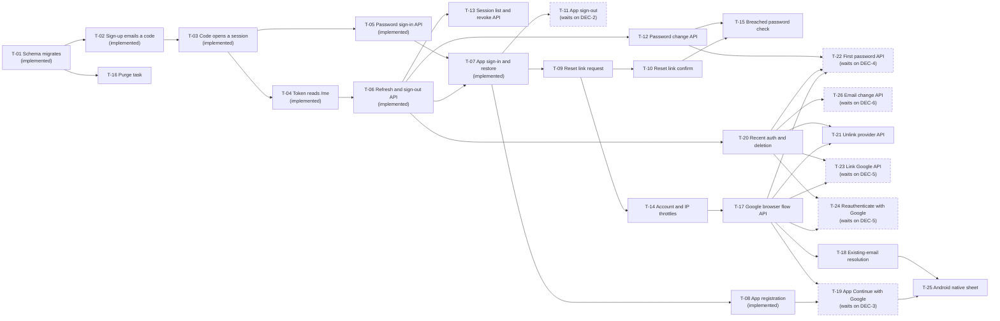

# Ticket plan: Authentication and authorization

- Status: in progress
- Updated: 2026-09-19 (T-01 through T-08 implemented; remaining decisions
  affect later tickets; terms version recording is deferred to the last MVP
  change)
- Source spec:
  [18_09_2026__auth-specification.md](../18_09_2026__auth-specification.md),
  whole document ("Authentication and authorization specification"), with
  [18_09_2026__auth-erd.md](../18_09_2026__auth-erd.md) for tables, keys, and
  retention

## At a glance

The plan delivers the spec's four phases (§13) as 26 vertical slices.
Nobody can sign in before an account can be verified, and no app page can hold
a session before the backend issues one, so Phase 1 builds the backend core
first, one API result per ticket: the schema (T-01), sign-up (T-02), the code
that opens a session (T-03), the access token (T-04), password sign-in (T-05),
and refresh with sign-out (T-06). T-07 then gives the app its token handling,
session cubit, router guard, and sign-in page, and every later app ticket
builds on it. After T-07, a flow with both an API and a page ships as one
ticket (T-09, T-10, T-25). Phase 2 adds password change, session revocation,
throttles, the breach check, and the purge task. Phase 3 adds Google through
the browser flow, then the operations that need a fresh credential proof.
Phase 4 adds the Android native sheet and email change. T-01 through T-08 are
implemented. Five later decisions block T-11, T-19, T-22, T-23, T-24, and
T-26; T-25 waits on one through T-19. The remaining tickets can otherwise be
built in file order while the proposed specification remains provisional
under DEC-0.

## Dependency map

Arrows point from the ticket that must land first. Dashed tickets also wait on
a decision. Edges are direct; a ticket also depends on everything upstream of
its blockers.

## Ordered tickets

| Order | Ticket                                                           | Status      | Outcome                                                                                          | Blocked by         | Spec trace                                           |
| ----- | ---------------------------------------------------------------- | ----------- | ------------------------------------------------------------------------------------------------ | ------------------ | ---------------------------------------------------- |
| 1     | [T-01](01-auth-schema-migrates.md)                               | Implemented | An operator migrates a fresh database to the eight auth tables                                   | None               | §10, §14, ERD                                        |
| 2     | [T-02](02-sign-up-emails-verification-code.md)                   | Implemented | Sign-up emails a code or a notice and never reveals existing accounts                            | T-01               | §6.1, §6.2, §7, §9, §10                              |
| 3     | [T-03](03-verification-code-opens-session.md)                    | Implemented | The emailed code verifies the email and opens a session                                          | T-02               | §5, §6.1, §7                                         |
| 4     | [T-04](04-access-token-reads-current-user.md)                    | Implemented | An access token authenticates requests and reads the signed-in user                              | T-03               | §5, §7, §8 rules 1, 2, and 4, §10                    |
| 5     | [T-05](05-password-sign-in-api.md)                               | Implemented | A verified person signs in with email and password through the API                               | T-03               | §6.2, §7, §9, §10                                    |
| 6     | [T-06](06-refresh-rotation-and-sign-out-api.md)                  | Implemented | Sessions refresh by rotation, detect reuse, and end on sign-out                                  | T-04               | §5, §7, §10                                          |
| 7     | [T-07](07-app-sign-in-and-session-restore.md)                    | Implemented | A verified person signs in on the app and stays signed in                                        | T-05, T-06         | §5, §11.1, §11.2, §13, §14                           |
| 8     | [T-08](08-app-registration-and-email-verification.md)            | Implemented | A new visitor registers in the app and verifies the emailed code                                 | T-07               | §5, §6.1, §11.1, §11.2                               |
| 9     | [T-09](09-password-reset-request.md)                             | Planned     | A person requests a password reset link from the forgot-password page                            | T-07               | §6.2, §7, §9, §11.3                                  |
| 10    | [T-10](10-password-reset-confirm.md)                             | Planned     | A person sets a new password from the reset link                                                 | T-09               | §6.2, §7, §11.1, §11.3                               |
| 11    | [T-11](11-app-sign-out.md)                                       | Blocked     | A signed-in person signs out of the app                                                          | T-07, DEC-2        | §7, §11.1                                            |
| 12    | [T-12](12-password-change-api.md)                                | Planned     | A signed-in person changes an existing password                                                  | T-06               | §5, §6.2, §7, §9                                     |
| 13    | [T-13](13-session-list-and-revocation-api.md)                    | Planned     | A signed-in person lists and revokes their sessions                                              | T-06               | §7, §8 rule 3, ERD                                   |
| 14    | [T-14](14-sign-in-and-ip-throttles.md)                           | Planned     | Repeated attempts are throttled per account and per IP                                           | T-09               | §4, §7, §9, §10                                      |
| 15    | [T-15](15-breached-password-rejection.md)                        | Planned     | Passwords found in known breaches are rejected                                                   | T-10, T-12         | §4, §6.2, §7, §9, §10                                |
| 16    | [T-16](16-purge-expired-auth-records.md)                         | Planned     | Expired auth records and deleted accounts are purged on schedule                                 | T-01               | §6.6, §10, ERD                                       |
| 17    | [T-17](17-google-browser-flow-sign-in-api.md)                    | Planned     | A person signs in with Google through the browser flow                                           | T-14               | D-5, D-7, §3, §6.4, §6.5, §7, §9, §10, §12, §15      |
| 18    | [T-18](18-google-sign-in-existing-email-api.md)                  | Planned     | A Google sign-in whose email already has an account links safely or refuses                      | T-17               | D-5, §6.5, §9                                        |
| 19    | [T-19](19-app-continue-with-google.md)                           | Blocked     | A person continues with Google in the app on the web, iOS, and Android                           | T-08, T-17, DEC-3  | §3, §4, §6.4, §11.1, §11.2, §14, §15                 |
| 20    | [T-20](20-account-deletion-with-recent-authentication.md)        | Planned     | A signed-in person deletes their account after a fresh password proof                            | T-06               | §5, §6.6, §7, §8 rule 5                                   |
| 21    | [T-21](21-unlink-provider-api.md)                                | Planned     | A person unlinks Google while keeping a way to sign in                                           | T-17, T-20         | §5, §7, §8 rule 3, ERD                                    |
| 22    | [T-22](22-set-first-password-api.md)                             | Blocked     | A social-only person sets a first password                                                       | T-12, T-17, T-20, DEC-4 | §5, §6.2, §7                                    |
| 23    | [T-23](23-link-google-api.md)                                    | Blocked     | A signed-in person links a Google identity                                                       | T-17, T-20, DEC-5  | §5, §6.4, §6.5, §7, §9                               |
| 24    | [T-24](24-reauthenticate-with-google-api.md)                     | Blocked     | A signed-in person re-authenticates with Google                                                  | T-17, T-20, DEC-5  | §5, §6.4, §6.5, §7                                   |
| 25    | [T-25](25-android-native-google-sign-in.md)                      | Planned     | An Android person signs in with the native Google sheet                                          | T-18, T-19         | §3, §4, §6.3, §7, §10, §11.1, §12, §14               |
| 26    | [T-26](26-email-change-api.md)                                   | Blocked     | A signed-in person changes their email address                                                   | T-20, DEC-6        | §5, §7, §9, ERD                                      |

## Shared constraints and risks

### Constraints every ticket follows

- **Structure.** Backend code lives in `features/auth/` with the layers of
  §10; shared code lives in `features/core/` and composition in `app/`. App code lives in
  `lib/features/auth/` with the layers of §11.1. Naming follows the root
  `AGENTS.md`: `<Verb><Noun>UseCase` with one `invoke`, `<Operation>Failure`
  with one variant per cause, and state names that say what is known.
- **Schema.** Revision `0001` (T-01) creates every auth table. A later ticket
  changes the schema only through a new Alembic revision and the matching ERD
  update. Mapped tables declare columns by annotation, with keys,
  constraints, and indexes in `__table_args__` (`apps/backend/AGENTS.md`).
- **Transactions and mail.** Each write use case owns one transaction and
  commits once. Email goes out after the commit; a send failure is logged, and
  the person uses "resend" (§10).
- **Errors.** RFC 9457 `application/problem+json` with a stable `code` member.
  Each domain failure maps to its status once, in handlers registered in
  `app/app.py`. A 401 carries `WWW-Authenticate: Bearer`. Every endpoint can
  also answer 422, and 429 `too_many_attempts` with `Retry-After` (§7).
- **Secrets.** Refresh tokens, exchange codes, and `state` are stored as
  SHA-256. Codes, reset tokens, and `identifier_hash` are stored as
  HMAC-SHA-256 with a server key. No provider token is stored (D-7, §9).
- **Settings.** Secrets are `SecretStr` values under `JSF_AUTH_`, never logged
  and never in the image. Every lifetime is a setting with the §5 default. New
  names get placeholders in `apps/backend/.env.example` (R-1).
- **Logging.** One `auth_events` row and one log record per security event.
  Neither holds a password, token, code, `state`, PKCE value, or raw email (§9).
- **Ownership.** Every repository method that touches user data takes
  `owner_id`, and the SQL filters by it. Another user's resource is a 404
  (§8 rule 3).
- **Enumeration.** Sign-up, resend, and reset request answer identically for
  known and unknown emails. Sign-in uses one failure code and equalized timing
  (§9).
- **App rules.** Visual values come only from the design system. Strings live
  in `AuthStrings` through `AppStrings`. Only the HTTP client package imports
  `dio` and `fresh_dio`. No package may need code generation (frontend
  `AGENTS.md`, §11.1).
- **Proof.** §14 and the app `AGENTS.md` files fix test levels, placement, and
  doubles. Tickets state only what must be proven.

### Readings this plan applies

The spec leaves these points open or states them in two places. Each reading
is the one the rest of the spec supports; veto any of them before its ticket
starts.

| ID   | Reading                                                                                                                                                                                                                                                                                 | Tickets          |
| ---- | --------------------------------------------------------------------------------------------------------------------------------------------------------------------------------------------------------------------------------------------------------------------------------------- | ---------------- |
| R-1  | The spec's `../../../.env.example` link resolves to the repository-root file, which holds tool keys. The backend reads `apps/backend/.env`, so `JSF_AUTH_*` placeholders go into `apps/backend/.env.example`.                                                                         | All backend      |
| R-2  | The 60-second interval between verification-code sends (§5) applies to every send: sign-up's third branch, resend, and password sign-in. A suppressed send keeps the open code valid. T-02 also leaves the password and name unchanged when sign-up's send is suppressed; §6.1 now says so.  | T-02, T-03, T-05 |
| R-3  | Each notice email ships with the flow that triggers it, although §13 lists "other notice emails" under Phase 2 without naming them.                                                                                                                                                   | T-02, T-10, T-12, T-18, T-23, T-26 |
| R-4  | Phase 1 hides only the Google button (row 4), as §13 says. The divider label (row 5) shows without a button above it until T-19.                                                                                                                                                      | T-07, T-08       |
| R-5  | `AppProviderSignInButton` and the Google mark land with their first consumer, T-19, instead of with Phase 1's other design system additions.                                                                                                                                          | T-07, T-19       |
| R-6  | `require_recent_authentication` lands with its first consumer, T-20, instead of with Phase 1's other guards.                                                                                                                                                                          | T-04, T-20       |
| R-7  | Until T-18, a Google sign-in whose email already belongs to a user fails with `account_exists_link_required`, the §6.5 branch that changes nothing.                                                                                                                                   | T-17             |
| R-8  | §7's row for `PUT /password` omits `password_too_weak` and `password_breached`. The §9 policy applies to every new password, so both codes can occur there.                                                                                                                            | T-12, T-15, T-22 |
| R-9  | Password sign-in reports `account_unavailable` only after the password verifies, like `email_verification_required`, so sign-in never reveals an account to someone without its password (§6.2, §9).                                                                                  | T-05             |
| R-10 | During Phase 3, Android uses the browser flow, as §3 allows, until T-25 adds the native sheet.                                                                                                                                                                                         | T-19, T-25       |

### Deferred concerns that no ticket owns

| Concern                                                        | Signal that adds it                                                                                          | Source           |
| -------------------------------------------------------------- | ------------------------------------------------------------------------------------------------------------ | ---------------- |
| Separate identity service instead of the in-process feature    | Redesign trigger: the product needs enterprise SSO (SAML), or several backends must share sign-in            | §1               |
| ES256 access tokens with a JWKS endpoint                       | A second service must verify access tokens                                                                   | §5               |
| Redis storage for the `limits` throttle                        | A second worker process appears                                                                              | §4               |
| RBAC tables, policy engine, OAuth scopes                       | Teams or workspaces arrive; membership checks then go into use cases                                         | D-8, §2, §8      |
| TOTP, passkeys, magic links, phone sign-in                     | Product asks for them; new factor tables or a new `email_challenges.purpose`                                 | §2               |
| Admin console, impersonation, suspension                       | Product asks for an admin console. Until then, nothing writes `users.suspended_at` or the `account_suspended` revocation reason, and `require_role` (T-04) has no consumer | §2, ERD, §8 rule 4 |
| Opening email links in the mobile app                          | Product asks for it; `app_links` 7.2.1 with Universal Links and App Links                                   | §2               |
| Apple and LinkedIn sign-in                                     | A new `provider` value, its verifier configuration, and console setup. Apple is also RISK-1                  | §2               |
| Account-settings pages (password change, sessions, link, unlink, re-authentication, deletion, email change) | §11 specifies no page, so T-12, T-13, T-20 to T-24, and T-26 ship as API only. Needed before the first App Store release (guideline 5.1.1(v) requires in-app deletion) and because `account_exists_link_required` tells people to use account settings | §6.5, §6.6, §11.2 |
| Web host configuration                                         | First web deployment: rewrite unknown paths to `index.html`, send `Referrer-Policy: no-referrer`, and terminate HTTPS with HSTS at the reverse proxy. The repository holds no host configuration | §9, §11.1 |
| Writer for `users.locale`                                      | No behavior in the spec sets it; the column stays null                                                       | ERD              |
| Least-privilege database role for the app                      | First deployment: the app and migrations connect as the PostgreSQL bootstrap superuser. Create a separate application role and keep the owner role for migrations and the throwaway-database tests | §9 |
| Remove-password use case                                       | The ERD names it as an enforcer of "at least one sign-in method", but the spec neither lists nor exposes it. T-21 is the only enforcer | ERD, §10 |
| Record of the accepted terms version                           | The last MVP change. A new revision restores `users.terms_version` and `terms_accepted_at`, which revision `0002` dropped; sign-up (T-02) and Google sign-up (T-17) stamp them from a `JSF_AUTH_TERMS_VERSION` setting. Until then, T-08's legal line links the documents but nothing records acceptance | §2, ERD |

### Risks

| ID     | Risk                                                                                                                                                              | Consequence                                                                     | Owner                  |
| ------ | ----------------------------------------------------------------------------------------------------------------------------------------------------------------- | ------------------------------------------------------------------------------- | ---------------------- |
| RISK-1 | App Store guideline 4.8 requires a privacy-preserving login beside Google on iOS (§15)                                                                            | The first iOS release is rejected without Sign in with Apple                    | PTLam                  |
| RISK-2 | The web app and the API must be same-site for the refresh cookie; a public-suffix host such as `*.vercel.app` is cross-site (§5)                                  | Web sessions cannot restore after a reload on such a host                       | PTLam, at deployment   |
| RISK-3 | The Resend sending domain is not verified yet (§15)                                                                                                               | Production mail reaches only the Resend account's own address                   | PTLam                  |
| RISK-4 | Google advertises PKCE but does not document it for the web-server flow (§15)                                                                                     | T-17 sends it and drops it if Google rejects it                                 | T-17 implementer       |
| RISK-5 | Shipped Safari may reject `Secure` cookies on `http://localhost` (§15)                                                                                            | Local web sign-in fails unless `JSF_AUTH_COOKIE_SECURE=false` is set            | T-03 implementer       |
| RISK-6 | The minimum password length is 12 by recommendation; NIST SP 800-63B-4 asks for 15 without MFA (§15)                                                             | Changing it touches the backend setting and the app's validation and helper text in T-08 and T-10 | PTLam        |
| RISK-7 | The headline and subtitle copy are Simplify's product claims (§15)                                                                                                | Replace both `AuthStrings` values before release                                | PTLam                  |
| RISK-8 | `url_launcher` is resolved at 6.3.2 in T-08. Only the future `crypto` dependency remains unchecked (§15)                                                         | T-19 must confirm `crypto` when adding it                                       | T-19 implementer       |
| RISK-9 | The spec gives no URLs for the Terms of Use and Privacy Policy                                                                                                    | T-08's legal links open whatever `AppSettings` is given; the documents must exist before release | PTLam   |
| RISK-10 | Provider consoles cannot be mocked (§14); T-17, T-19, and T-25 need a Google Cloud project with the §12 clients                                                  | Manual checks for those tickets wait on console setup                           | PTLam                  |
| RISK-11 | Resolved in T-03: confirmation requires the matching password, and five failed code-password pairs per user in the rolling verification-code lifetime consume the current challenge across replacements | The original replacement and distributed-guessing paths are closed | T-03 implementation |
| RISK-12 | The hash limiter's queue has no bound, and once the queue pushes a sign-up past the 500 ms floor, its branch timing shows again under load                        | Sign-up latency grows without limit under a flood, and a patient attacker may regain a statistical timing signal | T-14 implementer: bound the wait and answer 429 or 503 |

## Blocking decisions

Each decision belongs to the spec owner. Record the answer in the spec, then
remove the matching `DEC` from the waiting tickets.

| ID    | Decision needed                                                                                                                                                                                                                                                                                                                              | Owner | Waiting tickets                  | Consequence until decided                                                                                  |
| ----- | -------------------------------------------------------------------------------------------------------------------------------------------------------------------------------------------------------------------------------------------------------------------------------------------------------------------------------------------- | ----- | -------------------------------- | ---------------------------------------------------------------------------------------------------------- |
| DEC-0 | Confirm the spec as ready. It says "Status: proposed" and has no behavior IDs, so this plan traces to section numbers instead.                                                                                                                                                                                                                | PTLam | All, provisionally               | Any spec revision can change tickets that are already in progress                                          |
| DEC-2 | Specify the sign-out control: which page shows it, where, and its label. §11.1 lists `sign_out_use_case.dart` without a control.                                                                                                                                                                                                             | PTLam | T-11                             | The app signs out only when a refresh fails                                                                |
| DEC-3 | Decide whether the sign-in page shows the legal line under the Google button, because that button can also create an account. §15 recommends showing it; §11.2 row 10 shows it on sign-up only.                                                                                                                                             | PTLam | T-19; T-25 through it            | Google sign-in cannot ship in the app                                                                      |
| DEC-4 | Decide whether setting a first password revokes the user's other sessions and sends the "password changed" notice. §6.2 states both only for changing an existing password.                                                                                                                                                                  | PTLam | T-22                             | Social-only users can add a password only through the reset link (T-10)                                   |
| DEC-5 | Decide what `POST /oauth/exchange` does and returns for purposes `link` and `reauthenticate`. §7 promises a `TokenPair`, and §6.4 shows a new session, which fits `sign_in` only. Also name the failure when the user already has a Google identity (`(user_id, provider)` is unique), and when a `reauthenticate` identity belongs to another user or to nobody. | PTLam | T-23, T-24                       | People cannot link Google to an existing account, and social-only users cannot re-authenticate for T-20, T-21, or T-26 |
| DEC-6 | Decide the email change details: the response when the new address belongs to another account, given the §9 enumeration rule; whether confirming revokes other sessions; whether `change_email` codes share the verification code's 15 minutes, 5 attempts, and 60-second interval; and whether `email_verified_at` changes.              | PTLam | T-26                             | Email addresses cannot change                                                                              |
